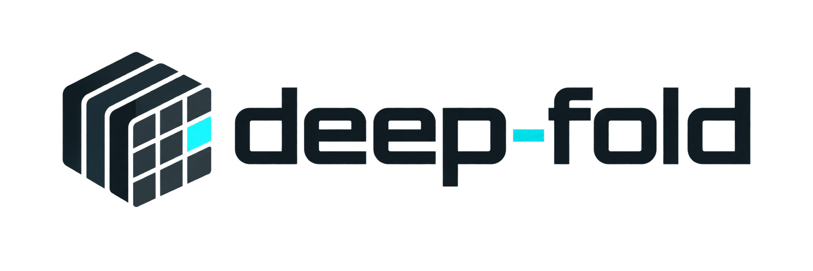
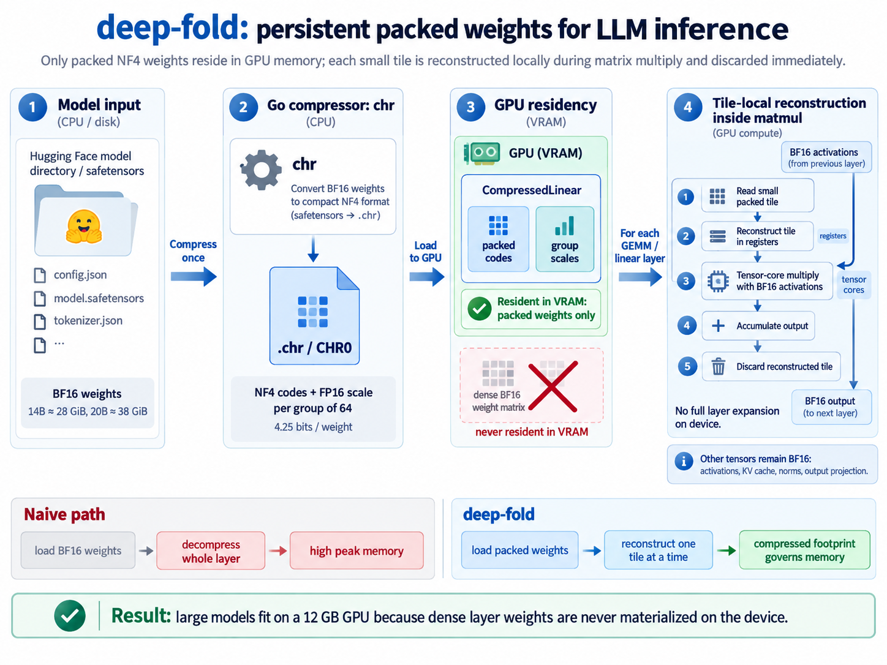
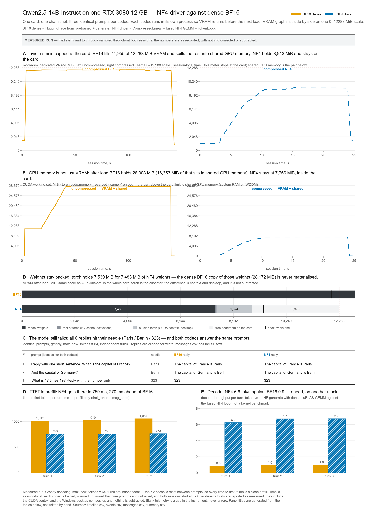

<p align="center">
  <picture>
    <source media="(prefers-color-scheme: dark)" srcset="img/logo_dark_theme_empty_background.png">
    
  </picture>
</p>

GitHub social preview: [`img/logo_dark_theme_empty_background_1280_x_640.png`](img/logo_dark_theme_empty_background_1280_x_640.png) (1280×640).

# deep-fold

**Persistent NF4 weights and tile-local reconstruction for LLM inference on a 12 GB GPU.**

[Method](#2-method) · [Results](#3-experimental-results) · [Limitations](#4-limitations) · [Installation](#5-installation) · [Quickstart](#6-quickstart) · [Reproduction](#8-reproducing-and-checking-results) · [Russian documentation](docs/quickstart.ru.md)

## Abstract

Running a language model on a memory-constrained GPU requires controlling both its stored weight representation and its working memory during inference. **deep-fold** implements an inference stack comprising a CPU compressor, the CHR0 container, packed PyTorch modules, a CUDA matrix-multiply kernel, and a generation loop. Quantized linear weights remain in NF4 storage; the kernel reconstructs BF16 operand fragments in registers as it consumes each tile, without materializing a complete dense linear weight matrix in device memory. When the packed model exceeds device capacity, a resident subset is combined with a pinned host tail streamed through two device slots.

Measurements recorded on one RTX 3080 12 GB show Qwen2.5-14B-Instruct and InternLM2.5-20B-Chat generating at **6.56** and **5.01 tokens/s**, respectively, with resident packed weights. Qwen2.5-32B-Instruct requires overflow and reaches **2.31 tokens/s** in a three-prompt smoke run. Under the same card, Instruct checkpoint, greedy decoding, context 2048, and the same three prompts, llama.cpp Q4_K_M generates at **1.52 tokens/s** (64-token decode plateau; `llama-bench` tg64 **1.47**): about **1.5× slower** than the NF4 overflow path. Protocol and numbers: [32B evaluation](docs/eval-32b.md), [committed summary](docs/runs/llamacpp-h2/SUMMARY.txt). These results demonstrate operation across the device-memory boundary. They do not rank Marlin, AWQ, Ollama, or other 4-bit engines, and they do not establish preservation of general model quality. NF4 and fused weight reconstruction are established techniques; the contribution here is their implementation and integration into an inspectable stack with explicit weight residency.



*Figure 1. The packed linear-weight path. In resident mode, packed matrices stay on the GPU. Overflow adds pinned host storage and two reusable device slots before the same GEMM kernel. The default embedding path separately decodes requested rows.*

## 1. Motivation and contribution

A dense BF16 matrix stores two bytes per weight. Quantizing weights reduces storage, but a runtime must also account for how they are consumed: expanding a complete matrix before GEMM adds a dense temporary allocation. Fusing reconstruction with multiplication avoids that allocation. It does not eliminate activations, KV cache, workspaces, or the bandwidth needed to read packed weights.

The repository implements five connected components:

| Component | Function |
|---|---|
| [`chr`](cmd/chr/) | CPU compression and verification of local Hugging Face safetensors |
| [CHR0](docs/spec/chr0.md) | A container for packed codes, group scales, tensor metadata, and unquantized payloads |
| [`gpu.host`](gpu/host/) | Builds a model on the meta device and attaches packed weights without loading a dense checkpoint onto the GPU |
| [`chr_nf4_gemm`](gpu/nf4/nf4_gemm.cu) | Reconstructs NF4 weights into BF16 register fragments and multiplies them using tensor-core instructions |
| [`TokenLoop`](gpu/loop/generate.py) and [`CopyRing`](gpu/loop/ring.py) | Greedy generation, chunked prefill, and explicit scheduling of overflow copies |

The terminal interface exposes this path through `deepfold doctor`, `pull`, `compress`, `run`, and `chat`. A separate runner collects machine metadata and smoke measurements on another computer.

### Relationship to prior work

NF4 was introduced in [QLoRA](https://arxiv.org/abs/2305.14314). deep-fold uses its 16 reconstruction levels with groups of 64 and one FP16 scale per group. This storage configuration has its own scale overhead; it should not be described as identical to every bitsandbytes configuration, including double quantization.

[Marlin](https://github.com/IST-DASLab/marlin) is an optimized FP16×INT4 kernel that combines low-bit storage with reconstruction during computation. [AWQ](https://arxiv.org/abs/2306.00978) combines activation-aware weight quantization with an inference implementation. These are relevant prior systems, not measurements of deep-fold. This repository claims neither priority for packed residency nor a new quantization codebook.

The contribution is the CHR0/Go implementation, its host and CUDA execution path, the overflow protocol, and the accompanying experiments. Establishing comparative performance requires matched measurements against other engines.

## 2. Method

### 2.1 Representation and storage

For each group of 64 weights, the file stores 64 four-bit codes and one FP16 scale:

$$
b_{\mathrm{NF4}} = 4 + \frac{16}{64} = 4.25\ \text{bits/weight}.
$$

For a matrix with logical shape $M\times K$, let $K_p=64\lceil K/64\rceil$. Its code-and-scale payload occupies

$$
S_{\mathrm{NF4}} = \frac{M K_p}{2} + 2M\frac{K_p}{64}\ \text{bytes}.
$$

For aligned matrices, this is approximately **3.76× smaller than BF16**. Container metadata, alignment, norms, biases, and runtime allocations are additional. NF4 is lossy: reconstructing the codes recovers quantized approximations, not the original weights.

### 2.2 Weight lifetime and arithmetic

1. The CPU compressor reads a local checkpoint and writes a `.chr` file.
2. The loader constructs the model structure on the meta device, replaces the required linear modules, and attaches packed codes and scales.
3. During GEMM, packed tiles are staged through shared memory. The kernel combines codes with group scales to form BF16 register fragments.
4. Tensor-core instructions multiply those fragments with BF16 activations and accumulate in FP32. Reconstructed linear weights are not written out as a dense device matrix.

The invariant concerns **linear weight storage**. It does not mean that every intermediate tensor exists only in registers.

| Data | Default NF4 path |
|---|---|
| Attention and MLP linear weights | Packed NF4 codes and FP16 scales |
| `lm_head` weights | Packed NF4; shared packed storage when tied to the embedding |
| Embedding weights | Packed NF4; requested rows reconstructed by `Nf4Embedding` |
| Norms and biases | BF16 payloads |
| Activations and KV cache | BF16 |
| GEMM accumulation | FP32; split-K can use a partial-result workspace |

Source: [`gpu/host/model.py`](gpu/host/model.py), [`gpu/host/embedding.py`](gpu/host/embedding.py), and [`gpu/nf4/nf4_gemm.cu`](gpu/nf4/nf4_gemm.cu).

### 2.3 Resident and overflow execution

**Resident mode.** Packed weights remain on the GPU throughout generation. The reported 3B, 14B, and 20B runs use this mode. Total device demand also includes the KV cache, activations, workspaces, CUDA allocations, and other GPU users.

**Overflow mode.** When the packed weights exceed the budget, policy D keeps embeddings, the output head, and attention projections resident. It moves selected MLP matrices into pinned host memory, prioritizing `down_proj`, then tail `gate_proj`/`up_proj` pairs. `CopyRing` transfers these packed matrices into two reusable device slots; GEMM consumes the slot views using the same NF4 kernel.

Events protect each slot from reuse before its GEMM completes. The Windows path additionally joins the current copy on the CPU before further prefetch; POSIX defaults differ. These choices reflect the measured WDDM behavior and are implemented in [`gpu/loop/ring.py`](gpu/loop/ring.py).

For the recorded 32B run:

| Quantity | Value |
|---|---:|
| Full packed NF4 payload | approximately 16,599 MiB |
| Device-resident weight storage reported by the loader | 9,716 MiB |
| Pinned host tail | 6,885 MiB across 96 matrices |
| Reusable copy slots | 2 × approximately 71.72 MiB |
| Preallocated KV cache at `max_seq=2048` | 512 MiB |

The loader's device-weight figure excludes the copy slots and KV cache. The host tail is transferred once per decode forward and once per prefill chunk. Compression reduces transfer volume; it does not remove the PCIe constraint.

### 2.4 Prefill and decode

`TokenLoop` drives the supported transformer graph directly. It does not use `transformers.generate` on the compressed path. Live prefill chunks contain at most **32 token positions**; the compiled 64-position path remains experimental tooling rather than the default generation path.

For small matrices, smaller row tiles and split-K increase the number of independent blocks available to the GPU. This addresses underutilization, but introduces its own reduction cost. Kernel timing and full generation timing answer different questions and are reported separately.

## 3. Experimental results

### 3.1 Protocol and evidence

The reference machine is a **single RTX 3080 12 GB**, reporting **12,288 MiB**, under Windows/WDDM. The card uses [GDDR6X](https://www.nvidia.com/en-us/geforce/graphics-cards/30-series/rtx-3080-3080ti/); “device memory” below means GPU VRAM.

The smoke protocol uses three fixed prompts, greedy decoding, and a cap of 64 new tokens per prompt. Prompts are independent and reset the attention cache. BF16 and NF4 sessions run in separate processes. TTFT is the reported prompt-processing/first-token latency after loading and warmup; it excludes download, compression, and first-time compilation. Decode throughput describes generation after the first token.

Numbers below are repository measurements, not independent replication. The source column distinguishes committed measurements from author-reported runs whose raw CSVs are outside git. Results from different historical kernel versions are not presented as one synchronized benchmark.

### 3.2 Runs with committed evidence

| Model / mode | Weight storage on device, MiB | TTFT, ms | Decode, tokens/s | Evidence |
|---|---:|---:|---:|---|
| Qwen2.5-3B, BF16 — historical pair | 5,886 | 52 | 23.15 | [CSV](docs/runs/qwen25-3b/summary.csv) |
| Qwen2.5-3B, NF4 resident — historical pair | 1,563 | 212 | 17.00 | [CSV](docs/runs/qwen25-3b/summary.csv) |
| Qwen2.5-14B, NF4 resident | 7,483 | 759 | 6.56 | [CSV](docs/runs/qwen25-14b/summary.csv) |
| InternLM2.5-20B, NF4 resident | 10,062 | 605 | 5.01 | [CSV](docs/runs/internlm20b/summary.csv) |
| Qwen2.5-32B, NF4 overflow | 9,716 + copy slots | 1,006 | 2.31 | [Run notes](docs/runs/h2-qwen25-32b/data_path.md), [replies](docs/runs/h2-qwen25-32b/messages.json) |
| Qwen2.5-32B, llama.cpp Q4_K_M | 11,520 (`nvidia-smi`) | 1,010 | 1.52 | [32B evaluation](docs/eval-32b.md), [summary](docs/runs/llamacpp-h2/SUMMARY.txt) |

The historical 3B, 14B, and 20B CSVs record `prefill_chunk=16`. The 32B notes record 32-position chunks. The 32B archive is a slim run record rather than the full original dump. The llama.cpp row is the same Instruct checkpoint and smoke protocol on the same 3080 (official CUDA `llama-server` b10964, bartowski Q4_K_M, `-ngl 99`, one slot). Decode **1.52 tokens/s** is the 64-token `ignore_eos` plateau; smoke-mean 1.55 and `llama-bench` tg64 1.47 sit on the same plateau. Relative to 2.31, llama.cpp is **1.5× slower**. Prefill is not the same comparison (`llama-bench` pp512 is 69.8 tokens/s).

**14B comparison.** The committed BF16 session reports **0.92 tokens/s** and **1,028 ms TTFT**, versus **6.56 tokens/s** and **759 ms** for NF4. Its after-load PyTorch allocation is 28,270 MiB, compared with 7,539 MiB for NF4. This is a dense, oversubscribed execution versus a resident packed execution on the recorded Windows system, not an isolated kernel comparison.



*Figure 2. The committed 14B comparison. Dedicated GPU usage and PyTorch allocator counters describe different quantities. See the metric definitions below; the existing figure's “working set” and derived “shared” labels require that distinction.*

**20B baseline.** BF16 loading was recorded, but generation failed because the model's remote generation code was incompatible with the installed Transformers version. No BF16 throughput is available. This is an environment failure, not evidence that a corrected BF16 baseline is impossible.

**32B overflow.** All three smoke replies passed. The transfer calibration gives approximately **277 ms per token** for serial copies of the host tail; measured generation takes approximately **432 ms per token**. The reciprocal of the copy-only estimate is about **3.6 tokens/s**. It is a transfer-only reference for this placement and calibration, not measured model throughput. No BF16 32B baseline or hard-12 evaluation is published for this run.

On that same machine and prompt set, llama.cpp Q4_K_M is slower at decode: **1.52 tokens/s** versus **2.31** (about **1.5×**). Evidence: [`docs/eval-32b.md`](docs/eval-32b.md) and [`docs/runs/llamacpp-h2/`](docs/runs/llamacpp-h2/). That is not a ranking against Ollama, Marlin, or AWQ.

### 3.3 Newer author-reported measurements

| Run | BF16 TTFT / decode | NF4 TTFT / decode | Evidence status |
|---|---|---|---|
| Qwen2.5-3B, paired run dated 2026-09-14 | 48 ms / 24.8 tokens/s | 92 ms / 28.7 tokens/s | Reported by the author; paired raw CSVs are outside git |

The newer pair suggests that the occupancy and prefill changes improved the implementation: NF4 decode is faster in this session, while BF16 still has lower TTFT. It must not be sourced to the older 3B CSV or plotted as though both came from the same run.

The author also reports a bitsandbytes NF4 smoke result of **22.8 tokens/s / 57 ms** from a separate environment. Its raw run is not committed; the [committed 3B competitor matrix](docs/runs/competitor-qwen25-3b/) contains skipped measurements. The matched 32B llama.cpp row above is the exception; it does not rank Marlin, AWQ, ExLlamaV2, vLLM, or Ollama.

### 3.4 Memory metrics

| Metric | Meaning |
|---|---|
| Packed payload / loader weight bytes | Storage attributable to packed model weights and associated payloads |
| `torch.cuda.memory_allocated()` | Memory occupied by PyTorch tensors |
| `torch.cuda.memory_reserved()` | Memory managed by the PyTorch caching allocator |
| `nvidia-smi` device usage | Device-level reading that can include the desktop and other processes |
| Pinned host bytes | CPU storage used for the overflow tail |

The `vram_after_load_torch_mib` summary field is populated from **`memory_allocated()`** in [`gpu/lab/sessions.py`](gpu/lab/sessions.py). The timeline separately records allocated and reserved values. Neither allocator counter directly measures Windows shared GPU memory, and subtracting whole-device `nvidia-smi` usage from a process allocator counter is not an exact shared-memory measurement. See the [PyTorch memory documentation](https://docs.pytorch.org/docs/stable/notes/cuda.html#cuda-memory-management).

### 3.5 Numerical checks and model quality

The repository separates three forms of checking:

| Check | What it can establish |
|---|---|
| CPU compression/round-trip metrics | Error introduced by the stored quantization |
| CUDA output against a CPU NF4 oracle | Arithmetic agreement for the quantized representation |
| Generated answers | Behavioral checks on the chosen prompts |

The committed 12-item reasoning fixture records **7/12 → 8/12** for Qwen2.5-3B and **9/12 → 10/12** for Qwen2.5-14B, BF16 → NF4. These are small regression fixtures, not evidence that quantization improves quality or is lossless. [Questions, responses, and scoring](docs/eval-hard-qwen25.md) are available with the [CSV matrix](docs/runs/hard-qwen25/hard_matrix.csv).

A corpus NLL adapter exists, but no WikiText perplexity result is published. The local GSM8K slice mentioned in the development records is not a full published GSM8K evaluation.

## 4. Limitations

- Performance evidence comes from one GPU and one Windows environment. Other supported compute capabilities are experimental; no Linux throughput measurement is published.
- The public model-download allowlist contains four models. Architecture inspection is broader than that list, but an accepted layout is not proof that an arbitrary checkpoint works.
- Generation is greedy. `chat` reloads no weights between turns, but re-prefills the entire conversation and does not reuse the KV prefix across turns. Transcripts are JSON under `$DEEPFOLD_HOME/chats`.
- `--max-seq` defaults to 512 for `run` and 2048 for `chat`. Longer contexts consume more KV memory; the current fit estimate uses a fixed runtime allowance and is not a guarantee for every context length or GPU workload.
- Overflow depends on host RAM, pinning, PCIe performance, and platform-specific synchronization. The current placement policy and automatic eligibility are conservative heuristics.
- VQ 2-bit remains explicit experimental tooling: its 3B chat canary failed. `--codec auto` selects NF4 or NF4 overflow, never VQ.
- Newer 3B and competitor claims still need their complete public run artifacts. Broad quality and comparative performance claims remain unestablished.

## 5. Installation

Use a repository checkout and an isolated environment. The setup scripts install CUDA PyTorch from the **cu124** index, install the CLI with `hub` and `chat` extras, build the Go compressor, and run diagnostics.

Prerequisites:

- Python 3.11 or 3.12 and Git. Go 1.22+ is optional: if `chr` is missing, setup downloads a portable Go 1.22 toolchain from go.dev into `$DEEPFOLD_HOME/toolchains`.
- An NVIDIA driver and a GPU accepted by `doctor`.
- For CUDA compilation: a compatible CUDA Toolkit with `nvcc`, MSVC Build Tools on Windows or `g++` on Linux, and Ninja.
- Disk space for the source safetensors plus the packed `.chr`; host memory sufficient for compression and any overflow tail.

The scripts do not install the NVIDIA driver, CUDA Toolkit, or host compiler. When no prebuilt NF4 extension is present, `doctor` fails unless both the host compiler and `nvcc` are available (`PATH`, or `CUDA_HOME` / `CUDA_PATH`). Setup success is not a completed generation test.

### Windows / PowerShell

```powershell
git clone https://github.com/wertick01/deep-fold.git
cd deep-fold
powershell -ExecutionPolicy Bypass -File scripts/setup.ps1
.\.venv\Scripts\Activate.ps1
python -m pip install ninja
deepfold doctor
```

### Linux / Bash

```bash
git clone https://github.com/wertick01/deep-fold.git
cd deep-fold
bash scripts/setup.sh
source .venv/bin/activate
python -m pip install ninja
deepfold doctor
```

The Linux install path is implemented. CPU CLI tests no longer require a Windows `chr.exe` next to the checkout. Published throughput belongs to the Windows reference machine.

| GPU / platform | Current status |
|---|---|
| RTX 3080 12 GB, `sm_86`, Windows | Measured configuration |
| Other `sm_86` hardware | Accepted capability; no equivalent performance guarantee |
| `sm_80`, `sm_87`, `sm_89` | Experimental generation support |
| Turing, Hopper, Blackwell | Generation rejected by the current capability gate |
| AMD, macOS, CPU-only | No generation path; CPU compression is separate |

If `deepfold` is not on PATH, use `python -m gpu.cli`. That is the expected
command in conda env `torch-gpu`. The `setup` subcommand updates the current
interpreter; the shell scripts create the repository `.venv`. Full
instructions: [English](docs/install.md), [Russian](docs/install.ru.md).

## 6. Quickstart

After installation, run these commands from the checkout in the activated environment. Explicit paths keep the example independent of the author's directory layout.

```text
deepfold pull Qwen/Qwen2.5-3B-Instruct --dir ./models/Qwen2.5-3B-Instruct --yes
deepfold compress --in ./models/Qwen2.5-3B-Instruct --out ./models/qwen25-3b.nf4.chr --codec nf4
deepfold run --model ./models/Qwen2.5-3B-Instruct --chr ./models/qwen25-3b.nf4.chr --prompt "What is the capital of France?" --max-new-tokens 32
deepfold chat --model ./models/Qwen2.5-3B-Instruct --chr ./models/qwen25-3b.nf4.chr
```

The source checkpoint must be unquantized safetensors, not GGUF. Download and compression happen before inference; the first CUDA run may also compile the kernel. `run` and `chat` can compress automatically when no packed file is found, so explicit compression is optional.

Keep the model's configuration, tokenizer, and any required remote-code files alongside a known matching `.chr`. Original weight shards are needed for recompression and verification. Automatic `.chr` matching compares CHR0 `arch`, hidden size, layer count, vocabulary size, and `intermediate_size` when the config has it; use `--chr` when two fine-tunes share those fields.

`pull` treats a tree as complete only when `config.json`, a tokenizer marker, and the safetensor shards (or every file named in a `*.safetensors.index.json` weight map) are present. A directory that only has `config.json` is downloaded again.

### Available downloads

| Hugging Face ID | Approximate source weights on disk | Recorded mode on 12 GB |
|---|---:|---|
| `Qwen/Qwen2.5-3B-Instruct` | 6.2 GB | Resident NF4 |
| `Qwen/Qwen2.5-14B-Instruct` | 29.5 GB | Resident NF4 |
| `internlm/internlm2_5-20b-chat` | 40 GB | Resident NF4 |
| `Qwen/Qwen2.5-32B-Instruct` | 65 GB | NF4 overflow |

Disk figures exclude the additional packed file and temporary/cache requirements. For InternLM, install the local extra from the checkout:

```text
python -m pip install -e ".[internlm]"
```

### Chat controls

| Input | Action |
|---|---|
| Enter | Submit |
| Ctrl+J | Insert a newline, subject to terminal key handling |
| Ctrl+C | Stop the current reply; at an empty prompt, twice to quit |
| `/help` | Show commands |
| `/stats` | Show the last turn's timings and why it stopped |
| `/clear` | Clear conversation history and reset the cache |
| `/new` | Start a new saved conversation |
| `/chats` | List and resume a saved conversation |
| `/copy` | Copy the last reply (or `/copy all` for the whole chat) |
| `/save [path]` | Write the last reply to a UTF-8 file |
| `/agent on` `/agent off` | Toggle workspace tools (list/read/write/pytest) |
| `/quit` or `/exit` | Exit |

`chat` requires a terminal. For scripts, use `run --prompt`; answer text goes to stdout and runtime diagnostics to stderr. Conversation history is JSON under `$DEEPFOLD_HOME/chats` and must fit within `--max-seq` (chat default 2048). Each turn re-prefills that history; the GPU KV cache is not reused across turns. Chat defaults to 256 new tokens per reply (`run` stays at 64). Clear the history, `/new`, or raise `--max-seq` when the context fills. Streamed replies render markdown (bold, lists, fenced code) and approximate `$...$` / `$$` LaTeX as Unicode; `/copy` still stores the raw model text.

`--agent` (or `/agent on`) lets the model call `list_dir`, `read_file`, `write_file`, and `run_tests` inside `--workspace` (default: the current directory). Writes and pytest ask `allow this tool? [y/N]` first. There is no general shell. Qwen2.5-14B follows the tool JSON more reliably than 3B.

## 7. CLI and configuration

| Command | Purpose |
|---|---|
| `deepfold doctor` | Inspect hardware and installation readiness |
| `deepfold setup --dry-run` | Show the setup commands without running them |
| `deepfold pull HF_ID --yes` | Download one allowlisted model |
| `deepfold compress --in DIR --out FILE --codec nf4` | Pack a local model on the CPU |
| `deepfold run --model DIR --chr FILE --prompt TEXT` | Generate a single answer |
| `deepfold chat --model DIR --chr FILE` | Start a conversation |
| `deepfold from-ollama qwen2.5:3b --yes` | Resolve an allowlisted tag to a Hugging Face download; does not import GGUF |
| `deepfold test` | Run CLI acceptance suites |
| `deepfold test --live` | Check local readiness; does not download or generate |

Common runtime options: `--max-new-tokens`, `--max-seq`, `--no-compress`, `--no-warmup`, and `--raw`. `--max-resident-mib` sets a packed-weight residency cap for overflow experiments. Use `deepfold COMMAND --help` for the full parser contract.

| Variable | Purpose |
|---|---|
| `DEEPFOLD_MODEL` | Default model directory |
| `DEEPFOLD_CHR` | Candidate packed file |
| `DEEPFOLD_CHR_BIN` | Compressor executable |
| `DEEPFOLD_MODELS` | Model root |
| `DEEPFOLD_HOME` | Cache root |
| `DEEPFOLD_RUNS` | Report directory root |
| `DEEPFOLD_COPY_JOIN` | Override overflow CPU joining; leave the platform default unless measuring it |

`doctor` exit codes: **0** readiness checks pass; **2** incomplete installation on an otherwise eligible machine; **3** generation is unsupported but compression is available; **1** neither path is ready. These are diagnostic outcomes, not benchmark results.

## 8. Reproducing and checking results

### CPU compressor

```bash
go test ./...
go build -o chr ./cmd/chr
./chr verify --orig ./models/Qwen2.5-3B-Instruct --chr ./models/qwen25-3b.nf4.chr --fail-rmse 0.12 --fail-maxabs 2.0 --json
```

On Windows, build `chr.exe` and invoke `.\chr.exe`. Verification thresholds describe quantization error, not model accuracy. Exit codes and definitions: [CPU round trip](docs/cpu-roundtrip.md).

### Measurements on another machine

Windows:

```powershell
powershell -File scripts/plate.ps1 3b --out ./runs/local-3b
```

Linux:

```bash
bash scripts/plate.sh 3b --out ./runs/local-3b
```

The runner performs CPU CLI tests, downloads if needed, compresses NF4, verifies against source shards when available, and runs the three-prompt smoke. It records machine information and the source checkout. It does not run a BF16 comparison or hard-12.

Keep the complete output directory, including `SUMMARY.txt`, `plate.json`, `verify.json` when produced, and `nf4/summary.csv` and `nf4/messages.csv` when generation completes. `--dry-run` writes a plan without downloading, compressing, or generating. Acceptance failures should be investigated rather than treated as successful portability evidence.

### BF16 versus NF4 laboratory

```text
python -m gpu.lab.run --model-dir ./models/Qwen2.5-3B-Instruct --chr ./models/qwen25-3b.nf4.chr --codec both --out ./runs/local-3b-paired
```

The laboratory is separate from the minimal CLI environment and uses its own reporting dependencies; see [the laboratory guide](docs/lab.md). A fair comparison records the commit, model revision, environment, prompts, token counts, context budget, warmup, and memory counters for both sessions.

For numerical kernel checks, start with [`gpu/nf4/verify.py`](gpu/nf4/verify.py) and [`gpu/nf4/numerics.py`](gpu/nf4/numerics.py). For overflow measurements, see [`gpu/lab/h2_trace.py`](gpu/lab/h2_trace.py) and [the 32B evaluation notes](docs/eval-32b.md). The `--dry-plot` laboratory mode uses synthetic fixtures and is not a measurement.

## 9. Documentation and development

| Topic | Entry point |
|---|---|
| Short installation workflow | [Quickstart](docs/quickstart.md), [Russian](docs/quickstart.ru.md) |
| CLI details | [Install](docs/install.md), [UX notes](docs/ux.md) |
| Container and NF4 layout | [CHR0](docs/spec/chr0.md), [NF4](docs/spec/nf4.md) |
| Kernel and generation | [Ampere kernel](docs/kernel-ampere.md), [TokenLoop](docs/token-loop.md) |
| Overflow placement and scheduling | [H2 design](docs/plan-h2-ring.md), [recorded data path](docs/runs/h2-qwen25-32b/data_path.md) |
| Experimental method and data | [Lab guide](docs/lab.md), [committed runs](docs/runs/) |
| Quality checks | [Hard-12](docs/eval-hard-qwen25.md), [local evaluation](docs/eval-local.md) |
| Kernel profiling | [Nsight records](docs/runs/ncu/) |
| 32B vs llama.cpp Q4_K_M (same 3080, llama.cpp 1.5× slower) | [32B evaluation](docs/eval-32b.md) |
| Other competitor stacks (3B grid still empty) | [Competitor environments](docs/competitor-venvs.md) |

Useful contributions include complete reproducible run artifacts, clean Windows/Linux installation tests, stronger checkpoint identity checks, broader quality evaluation, and matched comparisons with established 4-bit engines. Performance changes should include both numerical checks and measurements of the affected generation path.

## License

[MIT](LICENSE). Downloaded models retain their own licenses.

This project was created with [Cursor](https://cursor.com).
