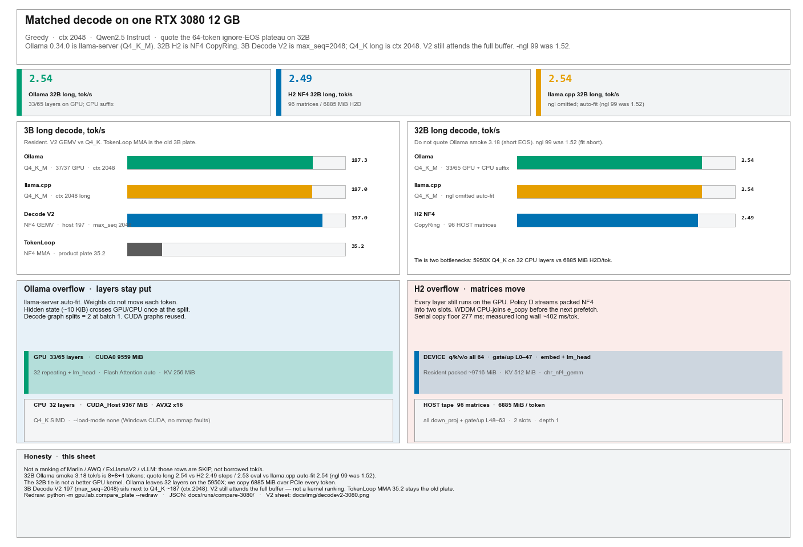
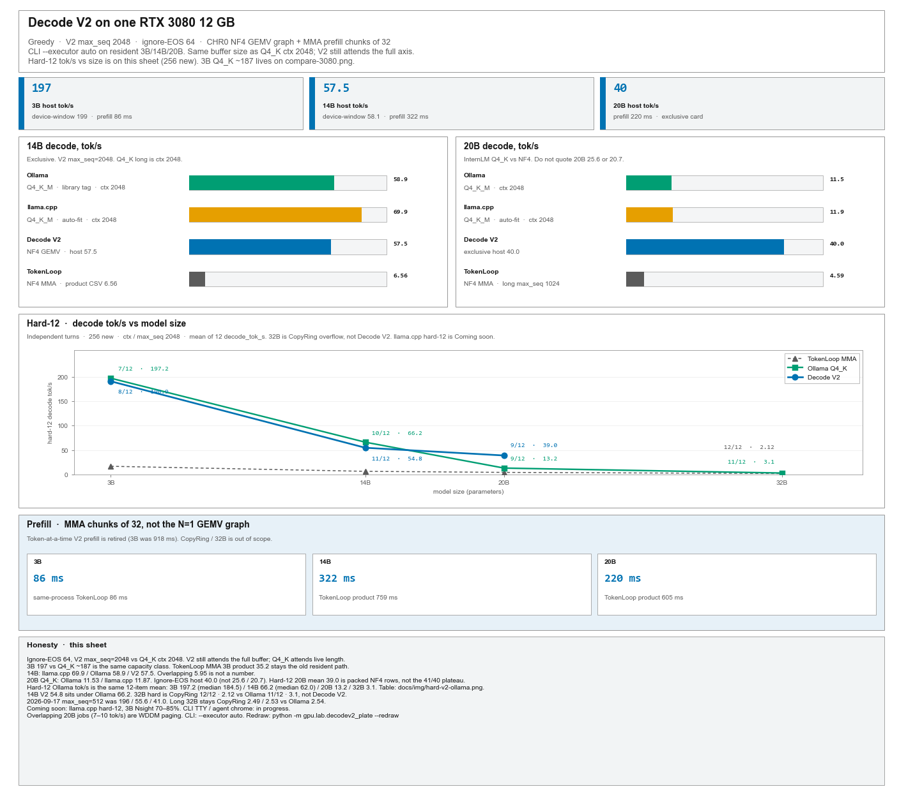
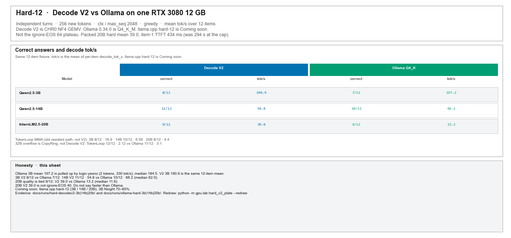

<p align="center">
  <picture>
    <source media="(prefers-color-scheme: dark)" srcset="img/logo_dark_theme_empty_background.png">
    
  </picture>
</p>

GitHub social preview: [`img/logo_dark_theme_empty_background_1280_x_640.png`](img/logo_dark_theme_empty_background_1280_x_640.png) (1280×640).

# deep-fold

**Packed NF4 weights that stay packed on a 12 GB GPU, reconstructed only inside each GEMM tile.**

[Method](#2-method) · [Results](#3-experimental-results) · [Limitations](#4-limitations) · [Installation](#5-installation) · [Quickstart](#6-quickstart) · [Reproduction](#8-reproducing-and-checking-results) · [Russian documentation](docs/quickstart.ru.md)

## Abstract

A 14B–32B model in BF16 does not fit on 12 GB. Quantizing the file is not enough if inference then expands every linear layer back to a full BF16 matrix before GEMM. That peak is still the 16-bit size, and the driver spills over PCIe.

**deep-fold** is a working stack for that constraint: a CPU compressor, the CHR0 container, packed PyTorch modules, an Ampere GEMM kernel, and a generation loop. Linear weights stay in NF4. The kernel rebuilds BF16 fragments in registers for each tile and throws them away. It never writes a dense weight matrix to device memory. If the packed model still does not fit, a resident subset stays on the GPU and a pinned host tail streams through two device slots.

On one RTX 3080 12 GB, resident **Decode V2** (NF4 GEMV graph, MMA prefill
chunks of 32, `max_seq=2048`) generates at **197** tok/s on Qwen2.5-3B (host;
device-window **199**), **57.5** on Qwen2.5-14B, and **40** on InternLM2.5-20B-Chat.
TokenLoop MMA on those models remains **35.2 / 6.56 / 5.01**. Qwen2.5-32B
still needs overflow CopyRing: **2.49** steps / **2.53** eval. Same card,
Ollama and llama.cpp auto-fit Q4_K_M 32B are both **2.54**; llama.cpp
`-ngl 99` is **1.52**. 3B Q4_K long is **~187** at ctx 2048; Decode V2 197
uses the same buffer size but still attends the full axis — same class, not a
kernel ranking. 14B: llama.cpp **69.9** / Ollama **58.9** / V2 **57.5**. CLI
`--executor auto` picks Decode V2 on resident NF4. Protocol:
[Decode V2 lab](docs/decode-v2-lab.md), [matched 3080 sheet](docs/compare-3080.md).

That shows the stack can run across the VRAM line. It is not a ranking of Marlin, AWQ, ExLlamaV2, or vLLM (those rows are SKIP). The 32B longs that share Ollama’s token timer (Ollama **2.54**, llama.cpp auto-fit **2.54**, H2 **2.53**) are essentially tied; the 3B TokenLoop **35.2** vs Q4_K **~187** is the old MMA path, not Decode V2. Placement, versions, and `-ngl` live in the compare sheet. NF4 and fused reconstruction are known techniques. What this repo adds is the CHR0/Go path, host + CUDA wiring, overflow, Decode V2, and measurements you can inspect.


*Figure 1. Packed linear weights. Resident mode keeps packed matrices on the GPU. Overflow adds pinned host storage and two reusable device slots, then the same GEMM kernel. Embeddings decode requested rows on a separate path.*

## 1. Motivation and contribution

A dense BF16 matrix is two bytes per weight. Quantizing shrinks storage. Expanding the whole matrix before GEMM puts a dense temporary back on the card. Fusing reconstruction with multiply avoids that allocation. It does not remove activations, KV cache, workspaces, or the bandwidth of reading packed weights.

Five pieces:

| Component | Function |
|---|---|
| [`chr`](cmd/chr/) | CPU compression and verification of local Hugging Face safetensors |
| [CHR0](docs/spec/chr0.md) | Packed codes, group scales, tensor metadata, unquantized payloads |
| [`gpu.host`](gpu/host/) | Builds the model on the meta device and attaches packed weights; no dense checkpoint on the GPU |
| [`chr_nf4_gemm`](gpu/nf4/nf4_gemm.cu) | NF4 → BF16 register fragments, then tensor-core multiply |
| [`chr_nf4_gemv`](gpu/nf4/nf4_gemv.cu) | N=1 CUDA-core GEMV; Decode V2 decode graph |
| [`TokenLoop`](gpu/loop/generate.py) and [`CopyRing`](gpu/loop/ring.py) | Greedy generation, chunked prefill, overflow copies |
| [`DecodeV2Loop`](gpu/decodev2/session.py) | Default CLI executor on resident NF4 (`--executor auto`) |

The CLI is `deepfold doctor`, `pull`, `compress`, `run`, and `chat`. **In progress:** TTY chrome / agent layout (neighbor chat). A separate runner records machine metadata and smoke numbers on another PC.

### Relationship to prior work

NF4 comes from [QLoRA](https://arxiv.org/abs/2305.14314). Here: 16 reconstruction levels, groups of 64, one FP16 scale per group. That is not every bitsandbytes layout (no claim of double quantization).

[Marlin](https://github.com/IST-DASLab/marlin) is an FP16×INT4 kernel with reconstruction in the multiply. [AWQ](https://arxiv.org/abs/2306.00978) is activation-aware quantization plus an inference path. Those are related systems, not scores for this repo. Packed residency is not claimed as a first. Neither is a new codebook.

The work here is CHR0/Go, the host and CUDA path, overflow, and the experiments. A real ranking still needs matched runs against other engines.

## 2. Method

### 2.1 Representation and storage

Each group of 64 weights stores 64 four-bit codes and one FP16 scale:

$$
b_{\mathrm{NF4}} = 4 + \frac{16}{64} = 4.25\ \text{bits/weight}.
$$

For a matrix with logical shape $M\times K$, let $K_p=64\lceil K/64\rceil$. Code-and-scale payload:

$$
S_{\mathrm{NF4}} = \frac{M K_p}{2} + 2M\frac{K_p}{64}\ \text{bytes}.
$$

For aligned matrices that is about **3.76× smaller than BF16**. Metadata, alignment, norms, biases, and runtime buffers are extra. NF4 is lossy: decode gives quantized values, not the original weights.

### 2.2 Weight lifetime and arithmetic

1. The CPU compressor reads a local checkpoint and writes a `.chr` file.
2. The loader builds the model on the meta device, swaps the linear modules, and attaches packed codes and scales.
3. During GEMM, packed tiles go through shared memory. The kernel turns codes + group scales into BF16 register fragments.
4. Tensor cores multiply those fragments with BF16 activations and accumulate in FP32. Reconstructed linear weights are not stored as a dense device matrix.

This is about **linear weight storage**. Other tensors still live in memory.

| Data | Default NF4 path |
|---|---|
| Attention and MLP linear weights | Packed NF4 codes and FP16 scales |
| `lm_head` weights | Packed NF4; shared packed storage when tied to the embedding |
| Embedding weights | Packed NF4; requested rows reconstructed by `Nf4Embedding` |
| Norms and biases | BF16 payloads |
| Activations and KV cache | BF16 |
| GEMM accumulation | FP32; split-K can use a partial-result workspace |

Source: [`gpu/host/model.py`](gpu/host/model.py), [`gpu/host/embedding.py`](gpu/host/embedding.py), [`gpu/nf4/nf4_gemm.cu`](gpu/nf4/nf4_gemm.cu).

### 2.3 Resident and overflow execution

**Resident mode.** Packed weights stay on the GPU for the whole run. The published 3B, 14B, and 20B numbers use this. Device use also includes KV, activations, workspaces, CUDA overhead, and other GPU clients.

**Overflow mode.** When packed weights exceed the budget, policy D keeps embeddings, the output head, and attention projections on device. Selected MLP matrices go to pinned host memory (`down_proj` first, then tail `gate_proj`/`up_proj` pairs). `CopyRing` copies them into two reusable device slots. GEMM uses the same NF4 kernel on those slot views.

Events keep a slot from being reused before its GEMM finishes. On Windows the current copy is also joined on the CPU before more prefetch; POSIX defaults differ. That matches measured WDDM behavior: [`gpu/loop/ring.py`](gpu/loop/ring.py).

Recorded 32B run:

| Quantity | Value |
|---|---:|
| Full packed NF4 payload | approximately 16,599 MiB |
| Device-resident weight storage reported by the loader | 9,716 MiB |
| Pinned host tail | 6,885 MiB across 96 matrices |
| Reusable copy slots | 2 × approximately 71.72 MiB |
| Preallocated KV cache at `max_seq=2048` | 512 MiB |

The loader weight figure excludes copy slots and KV. The host tail is copied once per decode forward and once per prefill chunk. Compression shrinks the transfer; it does not remove PCIe.

### 2.4 Prefill and decode

`TokenLoop` walks the transformer graph itself. It does not call `transformers.generate` on the packed path. Live prefill chunks are at most **32** token positions. The compiled 64-position path is experimental, not the default.

Resident CLI decode (`--executor auto`) uses Decode V2: an N=1 CUDA-core GEMV graph for each new token, and MMA prefill chunks of 32. Overflow, VQ, and `--executor tokenloop` stay on `TokenLoop`.

On small matrices, smaller row tiles and split-K launch more blocks. That helps occupancy and costs a reduction. Kernel microseconds and end-to-end tokens/s are different questions; they are reported separately.

## 3. Experimental results

### 3.1 Protocol and evidence

Reference machine: **one RTX 3080 12 GB** (**12,288 MiB**), Windows/WDDM, [GDDR6X](https://www.nvidia.com/en-us/geforce/graphics-cards/30-series/rtx-3080-3080ti/). “Device memory” means GPU VRAM.

Smoke: three fixed prompts, greedy decode, 64 new tokens max. Prompts are independent; the attention cache resets. BF16 and NF4 run in separate processes. TTFT is prompt-processing / first-token latency after load and warmup — not download, compress, or first JIT. Decode on TokenLoop is tokens/s after the first token (`decode_tok_s`, 63 steps on a 64-token plateau). `eval_tok_s` counts all generated tokens on the same wall and matches Ollama / llama.cpp `eval_count`. Decode V2 plates quoted here are ignore-EOS 64 at `max_seq=2048` (same buffer size as Q4_K ctx 2048; V2 still attends the full axis). Host tok/s includes a per-token `.item()`, so quote the device-window on WDDM too. Do not quote cached Ollama `prompt_eval` as TTFT.

These are repo measurements, not an outside replication. The evidence column says which rows have CSVs in git. Do not merge numbers from different kernel versions into one “benchmark”.

### 3.2 Runs with committed evidence

| Model / mode | Weight storage on device, MiB | TTFT, ms | Decode, tokens/s | Evidence |
|---|---:|---:|---:|---|
| Qwen2.5-3B, BF16 — historical pair | 5,886 | 52 | 23.15 | [CSV](docs/runs/qwen25-3b/summary.csv) |
| Qwen2.5-3B, NF4 TokenLoop — historical pair | 1,563 | 212 | 17.00 | [CSV](docs/runs/qwen25-3b/summary.csv) |
| Qwen2.5-3B, NF4 Decode V2 | packed NF4 rows | **86** | **197** host / **199** device | [lab](docs/decode-v2-lab.md) |
| Qwen2.5-14B, NF4 TokenLoop | 7,483 | 759 | 6.56 | [CSV](docs/runs/qwen25-14b/summary.csv) |
| Qwen2.5-14B, NF4 Decode V2 | 7,483 packed | **322** | **57.5** | [lab](docs/decode-v2-lab.md) |
| InternLM2.5-20B, NF4 TokenLoop | 10,062 | 605 | 5.01 | [CSV](docs/runs/internlm20b/summary.csv) |
| InternLM2.5-20B, NF4 Decode V2 | 10,062 packed | **220** | **40** exclusive | [lab](docs/decode-v2-lab.md) |
| Qwen2.5-32B, NF4 overflow TokenLoop | 9,716 + copy slots | 1,006 | 2.31 smoke / **2.49** steps / **2.53** eval | [Run notes](docs/runs/h2-qwen25-32b/data_path.md), [long](docs/runs/deepfold-long-32b/SUMMARY.txt) |

Decode V2 rows are exclusive 2026-09-17 plates ([lab log](docs/decode-v2-lab.md)), not the historical CSVs. TokenLoop 14B/20B CSVs stay the MMA numbers.

Matched engines on the same card (engine in the left column; launches and counters grouped under it):

<table>
<thead>
<tr>
<th>Engine</th>
<th>Launch / counter</th>
<th align="right">Weight / smi, MiB</th>
<th align="right">TTFT, ms</th>
<th align="right">3B long, tok/s</th>
<th align="right">32B long, tok/s</th>
<th>Evidence</th>
</tr>
</thead>
<tbody>
<tr>
<td>Ollama 0.34.0</td>
<td>Q4_K_M <code>qwen2.5:*</code></td>
<td align="right">11,559 smi</td>
<td align="right">n/a (cached <code>prompt_eval</code>)</td>
<td align="right"><strong>187.3</strong></td>
<td align="right"><strong>2.54</strong></td>
<td><a href="docs/eval-32b.md">32B evaluation</a>, <a href="docs/runs/ollama-h2-32b/SUMMARY.txt">summary</a></td>
</tr>
<tr>
<td rowspan="2">llama.cpp b10964 Q4_K_M</td>
<td>auto-fit (no <code>-ngl</code>)</td>
<td align="right">11,636 smi</td>
<td align="right">1,444</td>
<td align="right" rowspan="2"><strong>187.0</strong></td>
<td align="right"><strong>2.54</strong></td>
<td><a href="docs/runs/llamacpp-h2-autofit/SUMMARY.txt">auto-fit</a></td>
</tr>
<tr>
<td><code>-ngl 99</code></td>
<td align="right">11,520 smi</td>
<td align="right">1,010</td>
<td align="right">1.52</td>
<td><a href="docs/eval-32b.md">32B evaluation</a>, <a href="docs/runs/llamacpp-h2/SUMMARY.txt">summary</a></td>
</tr>
<tr>
<td rowspan="2">deep-fold NF4 TokenLoop</td>
<td>63 <code>step()</code> after first token</td>
<td align="right" rowspan="2">9,716 + copy slots</td>
<td align="right" rowspan="2">1,006 smoke / 925 long</td>
<td align="right"><strong>35.2</strong></td>
<td align="right"><strong>2.49</strong></td>
<td rowspan="2"><a href="docs/runs/h2-qwen25-32b/data_path.md">run notes</a>, <a href="docs/runs/deepfold-long-32b/SUMMARY.txt">long</a></td>
</tr>
<tr>
<td>64 generated tokens / same wall</td>
<td align="right"><strong>35.8</strong></td>
<td align="right"><strong>2.53</strong></td>
</tr>
<tr>
<td>deep-fold Decode V2</td>
<td>NF4 GEMV graph, <code>max_seq=2048</code></td>
<td align="right">—</td>
<td align="right">86 (3B prefill)</td>
<td align="right"><strong>197</strong></td>
<td align="right">—</td>
<td><a href="docs/decode-v2-lab.md">Decode V2 lab</a></td>
</tr>
</tbody>
</table>

The historical 3B/14B/20B CSVs used `prefill_chunk=16`. The 32B notes used 32-position chunks. The 32B git archive is a slim record, not the full dump.

Ollama 32B long **2.54**, llama.cpp auto-fit **2.54**, and H2 **2.53**
(`eval_tok_s`) share a token-count timer (quote long, not Ollama smoke 3.18).
Ollama auto-fit **33/65** layers and ran the rest on the 5950X; llama.cpp
without `-ngl` does the same class of split; H2 streamed 6885 MiB/token.
**1.52** is the `-ngl 99` fit-abort launch. Prefill is a different comparison
(`llama-bench` pp512 is 69.8 tokens/s). Sheet:
[compare-3080](docs/compare-3080.md), [figure](docs/img/compare-3080.png).

**14B.** Committed BF16: **0.92 tokens/s**, **1,028 ms TTFT**. NF4 TokenLoop:
**6.56 tokens/s**, **759 ms**. Decode V2 on the same weights: **57.5 tok/s**,
**322 ms** at `max_seq=2048` ([lab](docs/decode-v2-lab.md)). After-load PyTorch allocation
28,270 MiB vs 7,539 MiB. That is dense oversubscribe vs resident packed on
this Windows box, not an isolated kernel bake-off.


*Figure 2. Committed 14B comparison. Dedicated GPU use and PyTorch allocator counters are not the same thing. The figure’s “working set” / “shared” labels need that split.*

**20B.** BF16 load was recorded. Generation failed: the model’s remote generate code did not match the installed Transformers. No BF16 tokens/s. That is an environment miss, not proof a BF16 baseline is impossible. TokenLoop NF4: **5.01 tok/s**, **605 ms**. Decode V2 exclusive ignore-EOS: **40 tok/s** host, **220 ms** prefill (`max_seq=2048`). Do not quote the 25.6 / 20.7 device-windows (second 64-token pass at VRAM cap) or overlapping 20B jobs. Hard-12 on the same weights is **9/12** at **39.0 tok/s** (item-1 TTFT **434 ms**), not the ignore-EOS 40 plateau.

**32B overflow.** All three smoke replies passed. Serial copy of the host tail calibrates at about **277 ms/token** (~**3.6 tokens/s** if the wall were copy-only). Measured generation is about **432 ms/token**. The copy figure is a transfer reference, not model throughput. No BF16 32B baseline. TokenLoop 32B NF4 hard-12 is **12/12** (mean **2.12 tok/s**). Ollama 32B on the same fixture is **11/12** (mean **3.1 tok/s**, miss `gsm8k-stickers`); Ollama 3B is **7/12** at **197.2** tok/s.

H2 long decode is 63 steps after the first token (**2.49**); `eval_tok_s`
counts all 64 generated tokens on the same wall (**2.53**). Ollama
`eval_count=64` is **2.54**. Quote **2.53 vs 2.54** when matching the server
timer. Not enough to rank them.



*Figure 3. Quote 32B **long** plateaus. Ollama 2.54 vs llama.cpp auto-fit 2.54 vs H2 2.53 (`eval_tok_s`) is CPU-suffix vs CPU-suffix vs PCIe CopyRing, not a kernel win. H2 step rate is 2.49. llama.cpp 1.52 is `-ngl 99` (fit abort). 3B Decode V2 **197** (`max_seq=2048`) sits next to Q4_K **~187** (ctx 2048). V2 still attends the full buffer. TokenLoop MMA **35.2** is the old resident plate. SKIP rows stay SKIP. Redraw: `python -m gpu.lab.compare_plate --redraw`.*



*Figure 4. Decode V2 GEMV graph + MMA prefill-32. Headline V2 (`max_seq=2048`): 3B **197**, 14B **57.5**, 20B **40**. Exclusive Q4_K long (ctx 2048): 14B llama.cpp **69.9** / Ollama **58.9**; 20B Ollama **11.53** / llama.cpp **11.87**. Hard-12 panel is tok/s vs model size (3B / 14B / 20B), not caption cards. V2 still attends the full axis. Overlapping 14B 5.95 and 20B 25.6 / 20.7 are not decode. Redraw: `python -m gpu.lab.decodev2_plate --redraw`.*

### 3.3 Decode V2 (2026-09-18, `max_seq=2048`)

CLI default `--executor auto` uses Decode V2 on resident NF4 (3B / 14B / 20B) and TokenLoop on overflow / VQ. Greedy ids matched TokenLoop sequential N=1. Ignore-EOS 64, `max_seq=2048` to match Q4_K ctx 2048. V2 still attends the full buffer; Q4_K attends live length. Host tok/s includes a per-token `.item()`; quote the device-window on WDDM too.

| Model | TokenLoop MMA, tok/s | Decode V2 host / device, tok/s | Ollama Q4_K long | llama.cpp Q4_K long | Prefill V2, ms | Evidence |
|---|---:|---:|---:|---:|---:|---|
| Qwen2.5-3B | 35.2 (product plate) | **197** / **199** | **187.3** ctx 2048 | **187.0** ctx 2048 | **86** | [lab](docs/decode-v2-lab.md), [run](docs/runs/decodev2-3b-maxseq2048/) |
| Qwen2.5-14B | 6.56 (committed CSV) | **57.5** / **58.1** | **58.9** ctx 2048 | **69.9** ctx 2048 | **322** | [lab](docs/decode-v2-lab.md), [Ollama](docs/runs/ollama-h2-14b/), [llama.cpp](docs/runs/llamacpp-h2-14b/), [V2](docs/runs/decodev2-14b-maxseq2048/) |
| InternLM2.5-20B | 5.01 smoke / **4.59** long | **40** host | **11.53** ctx 2048 | **11.87** ctx 2048 | **220** | [lab](docs/decode-v2-lab.md), [Ollama](docs/runs/ollama-h2-20b/), [llama.cpp](docs/runs/llamacpp-h2-20b/), [V2](docs/runs/decodev2-20b-maxseq2048/) |

Do not merge those timers into “we beat llama.cpp”. 14B V2 **57.5** is under exclusive Ollama **58.9** and llama.cpp **69.9**. Overlapping Ollama 14B **5.95** and overlapping 20B jobs are not numbers. 20B device-window **25.6** / **20.7** is a second pass at the VRAM cap, not decode. 32B is still CopyRing. The 2026-09-17 `max_seq=512` plate was **196 / 55.6 / 41.0**.

Hard-12 (independent turns, 256 new tokens, same fixture as Ollama):

| Model | Decode V2 | Ollama Q4_K | llama.cpp Q4_K |
|---|---|---|---|
| Qwen2.5-3B | **8/12** · **190.9** tok/s | **7/12** · **197.2** tok/s | Coming soon |
| Qwen2.5-14B | **11/12** · **54.8** tok/s | **10/12** · **66.2** tok/s | Coming soon |
| InternLM2.5-20B | **9/12** · **39.0** tok/s | **9/12** · **13.2** tok/s | Coming soon |

Ollama tok/s is the mean of the 12 `decode_tok_s` already in `plate.json`. 3B mean **197.2** vs median **184.5** (`logic-yesno` is 2 tokens). 14B mean **66.2** vs median **62.0**. 20B hard-12 **39.0** is not the ignore-EOS **40**. Evidence: [3B](docs/runs/hard-decodev2-3b/), [14B](docs/runs/hard-decodev2-14b/), [20B](docs/runs/hard-decodev2-20b/), [Ollama 3B](docs/runs/ollama-hard-3b/), [Ollama 14B](docs/runs/ollama-hard-14b/), [Ollama 20B](docs/runs/ollama-hard-20b/). Table: [`docs/img/hard-v2-ollama.png`](docs/img/hard-v2-ollama.png).



*Figure 5. Same 12-item fixture. Decode V2 vs Ollama quality and mean decode tok/s. 14B V2 **54.8** sits under Ollama **66.2**. llama.cpp hard-12 is Coming soon. 3B V2 **190.9** is not faster than Ollama **197.2**. Redraw: `python -m gpu.lab.hard_v2_plate --redraw`.*

**Coming soon:** llama.cpp hard-12 (3B / 14B / 20B); 3B Nsight CUDA 70–85%. **In progress:** CLI TTY chrome / agent layout.

The 2026-09-14 paired 3B BF16 vs TokenLoop NF4 (48 ms / 24.8 vs 92 ms / 28.7) is a different stack. bitsandbytes NF4 smoke: **22.2 tok/s / 60 ms**. AWQ / GPTQ / ExLlamaV2 / vLLM stay SKIP.

### 3.4 Memory metrics

| Metric | Meaning |
|---|---|
| Packed payload / loader weight bytes | Packed model weights and related payloads |
| `torch.cuda.memory_allocated()` | Bytes in PyTorch tensors |
| `torch.cuda.memory_reserved()` | Bytes held by the caching allocator |
| `nvidia-smi` device usage | Whole-device reading; can include desktop and other processes |
| Pinned host bytes | CPU storage for the overflow tail |

`vram_after_load_torch_mib` comes from **`memory_allocated()`** in [`gpu/lab/sessions.py`](gpu/lab/sessions.py). The timeline also records reserved. Neither allocator counter is Windows shared GPU memory. Subtracting `nvidia-smi` from a process allocator is not a shared-memory measurement. [PyTorch CUDA memory notes](https://docs.pytorch.org/docs/stable/notes/cuda.html#cuda-memory-management).

### 3.5 Numerical checks and model quality

Three different checks:

| Check | What it can establish |
|---|---|
| CPU compression / round-trip | Error from stored quantization |
| CUDA vs a CPU NF4 oracle | Arithmetic match for the quantized values |
| Generated answers | Behavior on the chosen prompts |

The 12-item reasoning fixture: **7/12 → 8/12** for Qwen2.5-3B and **9/12 → 10/12** for Qwen2.5-14B (BF16 → NF4). Small regression, not “quantization helps” or “lossless”. [Questions, answers, scoring](docs/eval-hard-qwen25.md), [CSV](docs/runs/hard-qwen25/hard_matrix.csv).

There is a corpus NLL adapter. No published WikiText PPL. A local GSM8K slice in lab notes is not a full GSM8K eval.

## 4. Limitations

- One GPU, one Windows box. Other Ampere-family capabilities are experimental. No published Linux tokens/s.
- Public `pull` allowlist is four models. The architecture walker is wider than that list; a layout that parses is not a guarantee for an arbitrary checkpoint.
- Generation is greedy. `chat` does not reload weights between turns. Later turns prefill only the new suffix when the chat-template prefix matches. Transcripts are JSON under `$DEEPFOLD_HOME/chats`.
- `--max-seq` defaults to 512 for `run` and 2048 for `chat`. Longer context costs KV. The fit estimate uses a fixed runtime allowance, not a promise for every length or GPU load.
- Overflow depends on host RAM, pinning, PCIe, and OS sync. Placement and auto-eligibility are conservative heuristics.
- VQ 2-bit is explicit experimental tooling; the 3B chat canary failed. `--codec auto` picks NF4 or NF4 overflow, never VQ.
- Newer 3B and competitor claims still need full public artifacts. Broad quality and “faster than 4-bit engines” are not established. Matched 32B longs that share Ollama’s token timer (Ollama **2.54**, llama.cpp auto-fit **2.54**, H2 **2.53**) are tied, not a win. 3B Decode V2 **197** (`max_seq=2048`) and Q4_K **~187** (ctx 2048) are the same capacity class; V2 still attends the full buffer. TokenLoop MMA **35.2** is the old resident path. 14B V2 **57.5** is not faster than Ollama **58.9** or llama.cpp **69.9**.
- Decode V2 (`gpu/decodev2`) is the CLI default on resident NF4 (`--executor auto`). Overflow / VQ / 32B stay TokenLoop. Lab log: [`docs/decode-v2-lab.md`](docs/decode-v2-lab.md). Do not quote overlapping 20B jobs or the 25.6 / 20.7 device-windows as 20B decode. Hard-12 20B **39.0** is not ignore-EOS **40**.
- **Coming soon:** llama.cpp hard-12 (3B / 14B / 20B); 3B Nsight CUDA 70–85%. **In progress:** CLI TTY chrome / agent layout.
- A CPU/GPU layer split was tried on `exp/cpu-hybrid-overflow` and missed Ollama (**2.091** vs **2.54**). Default generate is still CopyRing **2.49**. Details stay on that branch.

## 5. Installation

Clone the repo and use an isolated env. The setup scripts install CUDA PyTorch from the **cu124** index, the CLI with `hub` and `chat`, the Go compressor, and (on Windows, if the kernel `.pyd` is missing) Visual Studio Build Tools plus CUDA 12.4 via winget, then compile `gpu/nf4` and run `doctor`.

You still need:

- Python 3.11 or 3.12 and Git. Go 1.22+ is optional: setup fetches a portable Go 1.22 from go.dev into `$DEEPFOLD_HOME/toolchains` when `chr` is missing.
- An NVIDIA driver and a GPU `doctor` will accept.
- For a from-source kernel: `nvcc`, MSVC Build Tools on Windows or `g++` on Linux, and Ninja. Windows setup will try winget for Build Tools and CUDA 12.4 if they are missing (UAC / Administrator is the reliable path).
- Disk for safetensors plus the packed `.chr`, and enough host RAM if you overflow.

The scripts do not install the NVIDIA driver. A green setup is not a finished generate test.

### Windows / PowerShell

```powershell
git clone https://github.com/wertick01/deep-fold.git
cd deep-fold
powershell -ExecutionPolicy Bypass -File scripts/setup.ps1
.\.venv\Scripts\Activate.ps1
deepfold doctor
```

### Linux / Bash

```bash
git clone https://github.com/wertick01/deep-fold.git
cd deep-fold
bash scripts/setup.sh
source .venv/bin/activate
deepfold doctor
```

Linux install works. Published tokens/s are from the Windows 3080.

| GPU / platform | Current status |
|---|---|
| RTX 3080 12 GB, `sm_86`, Windows | Measured configuration |
| Other `sm_86` hardware | Accepted capability; no matching performance claim |
| `sm_80`, `sm_87`, `sm_89` | Experimental generation |
| Turing, Hopper, Blackwell | Generation refused |
| AMD, macOS, CPU-only | No generate path; CPU compress is separate |

If `deepfold` is not on PATH, use `python -m gpu.cli`. That is normal in conda env `torch-gpu`. `setup` updates the current interpreter; the shell scripts create repo `.venv`. Full notes: [English](docs/install.md), [Russian](docs/install.ru.md).

## 6. Quickstart

From the checkout, activated env. Paths here are local, not the author’s `C:\dev\models`.

```text
deepfold pull Qwen/Qwen2.5-3B-Instruct --dir ./models/Qwen2.5-3B-Instruct --yes
deepfold compress --in ./models/Qwen2.5-3B-Instruct --out ./models/qwen25-3b.nf4.chr --codec nf4
deepfold run --model ./models/Qwen2.5-3B-Instruct --chr ./models/qwen25-3b.nf4.chr --prompt "What is the capital of France?" --max-new-tokens 32
deepfold chat --model ./models/Qwen2.5-3B-Instruct --chr ./models/qwen25-3b.nf4.chr
```

Source must be unquantized safetensors, not GGUF. Pull and compress happen before generate. The first CUDA run may compile the kernel. `run` / `chat` can compress if no `.chr` is found, so the explicit compress line is optional.

Keep `config.json`, the tokenizer, and any remote-code files next to a matching `.chr`. Weight shards are needed to recompress or `chr verify`. Auto-match uses CHR0 `arch`, hidden size, layers, vocab, and `intermediate_size` when present. Pass `--chr` if two fine-tunes share those fields.

`pull` treats a tree as complete only with `config.json`, a tokenizer marker, and the shards (or every file named in a `*.safetensors.index.json` map). A folder with only `config.json` is downloaded again.

### Available downloads

| Hugging Face ID | Approximate source weights on disk | Recorded mode on 12 GB |
|---|---:|---|
| `Qwen/Qwen2.5-3B-Instruct` | 6.2 GB | Resident NF4 |
| `Qwen/Qwen2.5-14B-Instruct` | 29.5 GB | Resident NF4 |
| `internlm/internlm2_5-20b-chat` | 40 GB | Resident NF4 |
| `Qwen/Qwen2.5-32B-Instruct` | 65 GB | NF4 overflow |

Disk figures omit the extra packed file and caches. InternLM extra:

```text
python -m pip install -e ".[internlm]"
```

### Chat controls

**In progress:** TTY chrome / agent layout.

| Input | Action |
|---|---|
| Enter | Submit |
| Ctrl+J | Newline (depends on the terminal) |
| Ctrl+C | Stop the current reply; at an empty prompt, twice to quit |
| `/help` | Commands |
| `/stats` | Last turn’s timings and stop reason |
| `/clear` | Clear history and reset the cache |
| `/new` | New saved conversation |
| `/chats` | List / resume a saved conversation |
| `/copy` | Copy last reply (`/copy all` for the whole chat) |
| `/save [path]` | Write last reply as UTF-8 |
| `/agent on` `/agent off` `/agent trust` `/agent default` | Workspace tools (grep/patch/pytest/allowlisted argv); web_search follows |
| `/quit` or `/exit` | Exit |

`chat` needs a real TTY. Scripts: `run --prompt` (answer on stdout, diagnostics on stderr). History is JSON under `$DEEPFOLD_HOME/chats` and must fit `--max-seq` (chat default 2048; `--agent` on 12 GB 14B picks 4096). Later turns prefill only the new suffix when the template prefix matches. Chat default is 256 new tokens (`run` stays at 64). `/clear`, `/new`, or raise `--max-seq` when context fills. The stream shows markdown and a Unicode sketch of `$...$` / `$$`; `/copy` keeps the raw model text.

`--agent` (or `/agent on`) is the coding-agent flag. The TTY can search
(`glob`/`grep`), patch (`str_replace`), run pytest, and run an allowlisted
`run_argv`. Writes and commands follow `--agent-trust` (`ask` default).
Session KV lives in `chat`; `run --prompt` still cold-prefills. 14B is the
agent model; 3B is chat/smoke. There is no general shell. `web_search`
turns on with `--agent` (free Tavily; [`walkthrough`](docs/web-search.md));
`--no-agent-web` keeps tools local. `/agent default on` or `DEEPFOLD_AGENT=1`
remembers this for the next `chat`. Brave or Google CSE only if those keys
are already set.

## 7. CLI and configuration

| Command | Purpose |
|---|---|
| `deepfold doctor` | Hardware and install check |
| `deepfold setup --dry-run` | Print setup commands, do not run them |
| `deepfold pull HF_ID --yes` | Download one allowlisted model |
| `deepfold compress --in DIR --out FILE --codec nf4` | Pack a local model on CPU |
| `deepfold run --model DIR --chr FILE --prompt TEXT` | One answer |
| `deepfold chat --model DIR --chr FILE` | Conversation |
| `deepfold from-ollama qwen2.5:3b --yes` | Allowlisted tag → Hugging Face download; not GGUF import |
| `deepfold test` | CLI acceptance |
| `deepfold test --live` | Local readiness; no download, no generate |

Common flags: `--max-new-tokens`, `--max-seq`, `--no-compress`, `--no-warmup`, `--raw`, `--executor auto|tokenloop|decodev2`. `--max-resident-mib` caps packed-weight residency for overflow experiments. `deepfold COMMAND --help` is the parser contract.

| Variable | Purpose |
|---|---|
| `DEEPFOLD_MODEL` | Default model directory |
| `DEEPFOLD_CHR` | Candidate packed file |
| `DEEPFOLD_CHR_BIN` | Compressor executable |
| `DEEPFOLD_MODELS` | Model root |
| `DEEPFOLD_HOME` | Cache root |
| `DEEPFOLD_AGENT` | `1` = `chat` starts with tools (`prefs.env` or `/agent default on`) |
| `DEEPFOLD_AGENT_WEB` | `0` = keep `web_search` off when agent is on; default follows agent |
| `DEEPFOLD_TAVILY_KEY` | Optional Tavily token for `web_search` (keyless works with none) |
| `DEEPFOLD_BRAVE_KEY` | Optional Brave Search token (wins over Tavily if set) |
| `DEEPFOLD_GOOGLE_CSE_KEY` | Custom Search JSON API key (legacy; or `cse.env`) |
| `DEEPFOLD_GOOGLE_CSE_CX` | Programmable Search engine id |
| `DEEPFOLD_RUNS` | Report directory root |
| `DEEPFOLD_COPY_JOIN` | Override overflow CPU joining; leave the default unless you are measuring it |

`doctor` exits: **0** ready; **2** this card could run, install incomplete; **3** generate unsupported, compress may still work; **1** neither. Diagnostics, not a benchmark.

## 8. Reproducing and checking results

### CPU compressor

```bash
go test ./...
go build -o chr ./cmd/chr
./chr verify --orig ./models/Qwen2.5-3B-Instruct --chr ./models/qwen25-3b.nf4.chr --fail-rmse 0.12 --fail-maxabs 2.0 --json
```

Windows: `chr.exe` / `.\chr.exe`. Thresholds are quantization error, not model quality. [CPU round trip](docs/cpu-roundtrip.md).

### Measurements on another machine

Windows:

```powershell
powershell -File scripts/plate.ps1 3b --out ./runs/local-3b
```

Linux:

```bash
bash scripts/plate.sh 3b --out ./runs/local-3b
```

The runner does CPU CLI tests, downloads if needed, NF4 compress, verify against shards when present, and the three-prompt smoke. It records the machine and checkout. No BF16 pair, no hard-12.

Keep the whole output dir: `SUMMARY.txt`, `plate.json`, `verify.json` if produced, and `nf4/summary.csv` / `nf4/messages.csv` if generate finished. `--dry-run` plans only. A failed acceptance is not a portability win.

### BF16 versus NF4 laboratory

```text
python -m gpu.lab.run --model-dir ./models/Qwen2.5-3B-Instruct --chr ./models/qwen25-3b.nf4.chr --codec both --out ./runs/local-3b-paired
```

This is a separate stack from the small CLI env: [lab guide](docs/lab.md). A fair pair records commit, model revision, env, prompts, token counts, context, warmup, and memory counters for both sessions.

Kernel checks: [`gpu/nf4/verify.py`](gpu/nf4/verify.py), [`gpu/nf4/numerics.py`](gpu/nf4/numerics.py). Overflow: [`gpu/lab/h2_trace.py`](gpu/lab/h2_trace.py), [32B notes](docs/eval-32b.md). Matched engines: [`python -m gpu.lab.compare_plate --redraw`](docs/compare-3080.md). Decode V2 sheet: `python -m gpu.lab.decodev2_plate --redraw`. `--dry-plot` uses synthetic fixtures. Do not publish those numbers as measurements.

## 9. Documentation and development

| Topic | Entry point |
|---|---|
| Short install | [Quickstart](docs/quickstart.md), [Russian](docs/quickstart.ru.md) |
| CLI details | [Install](docs/install.md), [UX notes](docs/ux.md) |
| Agent mode (tools + session KV in CLI) | [Agent spec](docs/spec/agent.md) |
| Agent web search (free Tavily) | [English](docs/web-search.md), [Russian](docs/web-search.ru.md) |
| Container and NF4 layout | [CHR0](docs/spec/chr0.md), [NF4](docs/spec/nf4.md) |
| Kernel and generation | [Ampere kernel](docs/kernel-ampere.md), [TokenLoop](docs/token-loop.md) |
| Overflow | [H2 design](docs/plan-h2-ring.md), [recorded data path](docs/runs/h2-qwen25-32b/data_path.md) |
| Method and data | [Lab guide](docs/lab.md), [committed runs](docs/runs/) |
| Quality checks | [Hard-12](docs/eval-hard-qwen25.md), [local evaluation](docs/eval-local.md) |
| Kernel profiling | [Nsight records](docs/runs/ncu/) |
| 32B vs Ollama / llama.cpp Q4_K_M (same 3080) | [32B evaluation](docs/eval-32b.md), [compare sheet](docs/compare-3080.md) |
| Decode V2 (resident GEMV; CLI `--executor auto`) | [Lab log](docs/decode-v2-lab.md), [contract](docs/decode-v2.md), [figure](docs/img/decodev2-3080.png), [hard-12 vs Ollama](docs/img/hard-v2-ollama.png) |
| Other competitor stacks (AWQ / Marlin / ExLlama / vLLM still SKIP) | [Competitor environments](docs/competitor-venvs.md) |

Useful PRs: complete run artifacts, Windows/Linux install tests, stronger checkpoint identity, broader quality eval, matched 4-bit engine comparisons. Perf changes should come with both numerical checks and generate-path timings.

## License

[MIT](LICENSE). Downloaded models keep their own licenses.

This project was created with [Cursor](https://cursor.com).
