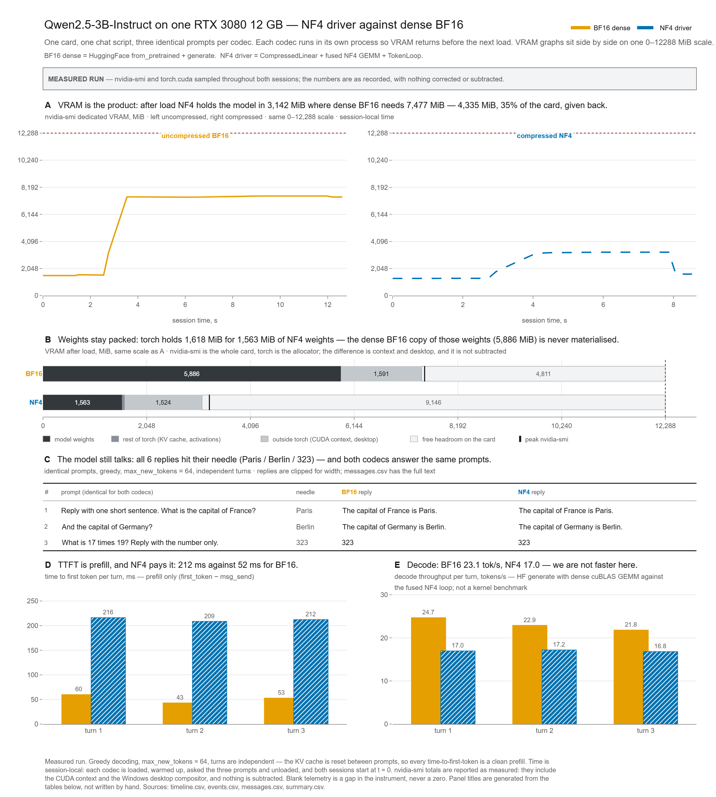
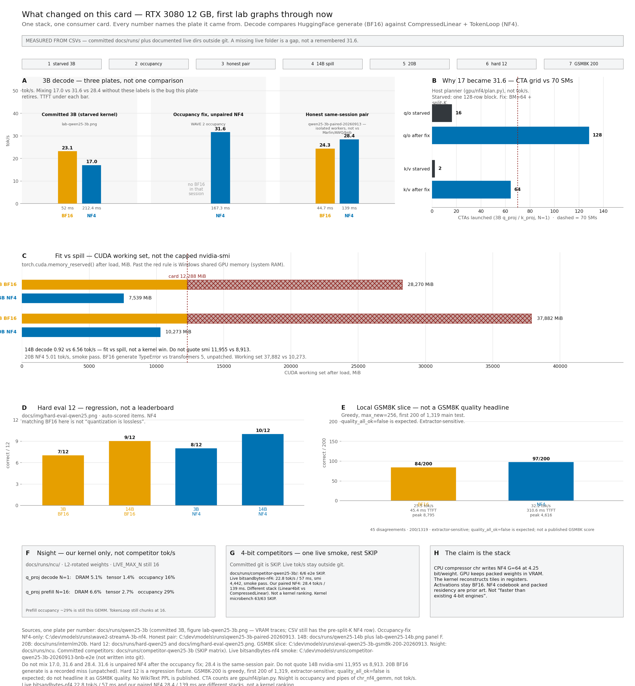
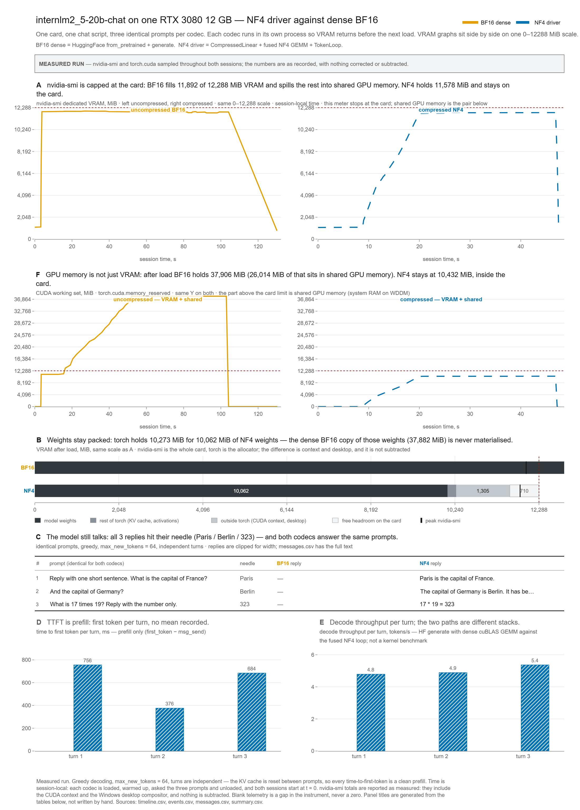
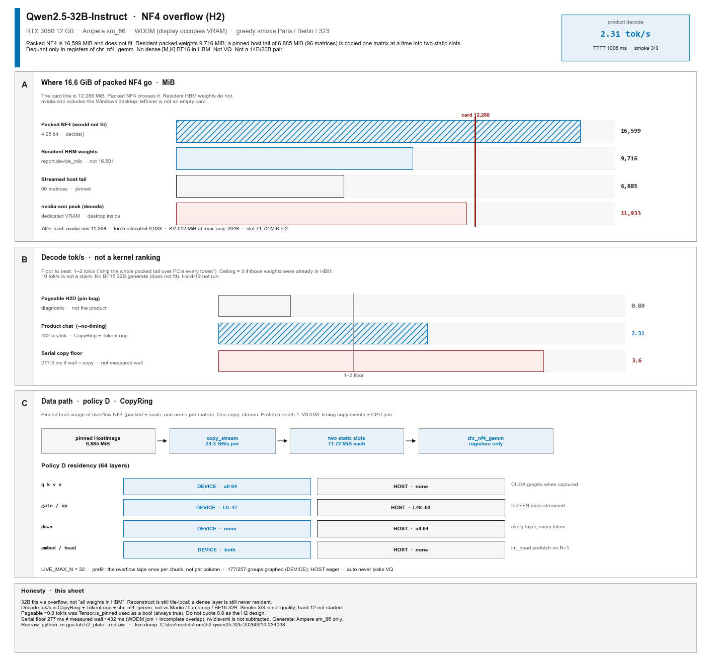
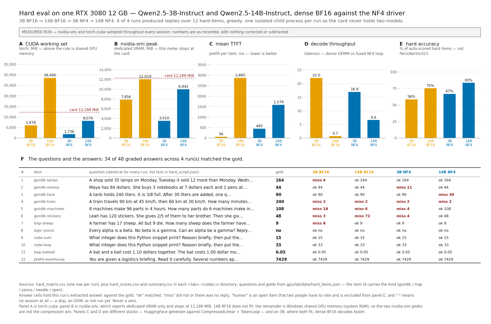

<p align="center">
  <picture>
    <source media="(prefers-color-scheme: dark)" srcset="img/logo_dark_theme_empty_background.png">
    
  </picture>
</p>

# deep-fold

**Аннотация.** Шестнадцатибитные веса языковой модели на 14, 20 или 32 миллиарда
параметров занимают около 28–65 ГиБ — в два–пять раз больше, чем карта на 12 ГБ.
Записать те же веса меньшим числом бит само по себе недостаточно. Если перед
матричным умножением слой снова разворачивают в шестнадцать бит, в пике на
карте снова лежит полноразмерная копия, и занятость видеопамяти по-прежнему
задаётся исходным размером. Недостающее драйвер берёт из оперативной памяти по
шине; генерация почти останавливается.

Нового числового кода эта работа не предлагает. Четырёхбитное представление
(NF4: шестнадцать уровней восстановления, группы по 64, один масштабный
коэффициент на группу) принадлежит тому же семейству, что bitsandbytes / QLoRA.
Восстановление значений внутри матричного умножения тоже известно — например, у
Marlin и у части ядер AWQ. Держать веса упакованными всё время работы — тоже не
новость: так делают `Linear4bit` из bitsandbytes и ядра W4A16.

Этот репозиторий предлагает не первенство, а полный **стек**, собранный вокруг
того, **где веса живут всё время работы**, и измеренный от начала до конца на
одной потребительской карте. Само по себе «веса лежат упакованными» — prior
art (`Linear4bit`, Marlin, AWQ W4A16); утверждение про стек, не про эту идею.
Веса один раз упаковывают на процессоре в один
файл `.chr`. На GPU у линейного слоя нет другой хранимой формы, кроме этой
упакованной таблицы: у модуля нет плотной матрицы весов, поэтому полноразмерный
слой нельзя незаметно воссоздать. Во время каждого
умножения процессор читает небольшой фрагмент упакованных значений,
восстанавливает их в регистрах (самая маленькая и самая быстрая память на
чипе), умножает и восстановленные числа выбрасывает. В видеопамяти слой от
загрузки до выхода остаётся упакованным. Поэтому место модели на карте равно
сжатому размеру, а не шестнадцатибитному. Если сжатый файл всё ещё больше
карты, в HBM лежит только резидентная часть плюс два слота копирования; хвост
остаётся упакованным в pinned-памяти хоста. Полного плотного слоя на устройстве
нет ни в один момент времени.

Измерено на одной RTX 3080 12 ГБ: Qwen2.5-14B-Instruct (~28 ГиБ 16-битных
весов) выдаёт около 6,6 токена в секунду; internlm2.5-20B (~38 ГиБ) — около 5,0.
Та же 14B в шестнадцати битах, с выносом за карту, — 0,92. У Qwen2.5-32B
упакованный NF4 всё ещё ~16,6 ГиБ и на карту не влезает; overflow-путь везёт
pinned-хвост с хоста и выдаёт 2,31 токена в секунду. Тот же ПК, тот же
Instruct, жадный дым, ctx 2048: llama.cpp Q4_K_M даёт **1,52 ток/с**
(плато 64 токена; `llama-bench` tg64 **1,47**) — примерно **в 1,5 раза
медленнее**. Протокол и цифры: [docs/eval-32b.md](docs/eval-32b.md),
[docs/runs/llamacpp-h2/SUMMARY.txt](docs/runs/llamacpp-h2/SUMMARY.txt).
Когда влезают оба
варианта (3B), decode на упакованном пути уже быстрее; время до первого токена
по-прежнему больше. Сжатие окупается, когда несжатая модель на карту не
помещается.


*Рисунок. Веса один раз упаковывают на CPU в файл `.chr`. На GPU у линейного слоя только упакованные коды и групповые шкалы; каждое умножение восстанавливает фрагмент в регистрах и выбрасывает его. Плотного слоя в видеопамяти нет ни в один момент.*

English version: [README.md](README.md).

## Задача

Трансформер — это в основном стопка линейных слоёв, и каждый линейный слой
представляет собой прямоугольную таблицу чисел, свои веса. В файлах модели эти
числа обычно хранятся в формате **BF16** — bfloat16, 16-битный формат с
плавающей точкой, два байта на вес. Поэтому модели на 14 миллиардов параметров
нужно около 28 ГиБ только под веса, а модели на 20 миллиардов — около 38 ГиБ. На
этой карте 12 ГиБ. Веса не влезают, и не влезают в два-три раза.

Хранить веса в меньшем числе бит — необходимый шаг, но недостаточный. Обычный
способ считать со сжатыми весами — превратить слой обратно в полноразмерную
16-битную таблицу и вызвать на ней обычное матричное умножение. В момент этого
превращения полноразмерная таблица снова существует в видеопамяти, поэтому пик
памяти, который карта обязана обеспечить, по-прежнему определяется 16-битным
размером, а не сжатым. Когда этот пик превышает объём карты, драйвер добирает
недостающее из системной оперативной памяти по шине PCI Express, и генерация
почти останавливается (измерено ниже: 0,92 токена в секунду на 14B).

## Что сделано

Сделан полный путь от 16-битного файла модели до сгенерированных токенов, на
котором полноразмерная копия слоя на карте не создаётся ни разу. Он состоит из
четырёх частей.

1. **Компрессор, работающий на процессоре.** `chr`, написан на Go, читает
   каталог модели HuggingFace с safetensors в BF16 и пишет один файл с
   расширением `.chr`; формат контейнера обозначен четырьмя символами **CHR0**.
   Веса хранятся в формате **NF4**: каждый вес заменяется одним из 16 уровней
   восстановления, веса обрабатываются группами по 64, и каждая группа хранит
   свой собственный масштабный коэффициент. С учётом коэффициентов это выходит
   4,25 бита на вес вместо 16 (четырёхбитные коды плюс одна шкала FP16 на
   группу из 64: 4 + 16/64).
2. **Замена `torch.nn.Linear` из PyTorch, которая не способна хранить плотную
   матрицу весов.** У `gpu.host.CompressedLinear` вообще нет тензора весов
   `[out, in]` ни среди параметров, ни среди буферов; упакованные коды и
   масштабные коэффициенты групп — единственное постоянное хранилище весов. Это
   свойство устройства класса, а не договорённость: у `model.to("cuda")` просто
   нет весов полной точности, которые можно было бы перенести, поэтому никакая
   обычная операция PyTorch не в состоянии незаметно затащить полноразмерный
   слой в видеопамять.
3. **Ядро матричного умножения для GPU NVIDIA Ampere** (вычислительная
   способность 8.6 — именно она у RTX 3080), которое умножает прямо на
   упакованном представлении. Для каждого небольшого блока таблицы весов —
   *фрагмента* размером в единицы килобайт — ядро читает упакованные коды и
   соответствующие масштабные коэффициенты групп, восстанавливает эти несколько
   тысяч значений в регистрах процессора, самой быстрой и самой маленькой памяти
   на чипе (несколько сотен байт на поток), умножает их на входящие активации,
   добавляет произведения в накопитель и после этого восстановленные значения
   выбрасывает. Копия слоя в видеопамяти только читается, поэтому от загрузки до
   выхода остаётся упакованной. `lm_head` и остальные линейные слои упакованы в
   NF4; в BF16 остаются активации, кэш внимания, нормы и смещения: сжимаются
   веса, а не обрабатываемый текст.
4. **Цикл генерации, который использует эти слои.** `gpu.loop.TokenLoop` сам
   ведёт граф слоёв трансформера и обрабатывает промпт порциями не более 32
   позиций. На сжатом пути он не вызывает `transformers.generate`. Когда
   упакованная таблица влезает (3B, 14B, 20B), эти веса остаются на карте.
   Когда нет (Qwen2.5-32B на 12 ГБ), `CopyRing` копирует overflow-матрицы из
   pinned-образа хоста в два статических слота; `chr_nf4_gemm` по-прежнему
   восстанавливает в регистрах. Плотной копии `[M,K]` в видеопамяти нет.
   `--codec auto` никогда не выбирает VQ.

**Почему это важно.** Поскольку вторая копия слоя в полной точности не
материализуется никогда, память, которую модель занимает на карте, определяется
размером её *сжатых* весов, а не размером исходных 16-битных. Модель на 14B с
28 172 МиБ 16-битных весов и модель на 20B с 37 882 МиБ обе загружаются на карту
на 12 ГиБ и там генерируют текст — при 7 483 МиБ и 10 062 МиБ упакованных весов
соответственно. Модель на 32B с ~16 599 МиБ упакованного NF4 всё ещё не влезает:
9 716 МиБ остаются резидентными, 6 885 МиБ едут из pinned-памяти хоста, 2,31
токена в секунду. Сжатие не даёт ускорения само по себе: на модели 3B на эту карту
влезают оба варианта. Decode на упакованном пути теперь впереди (28,7
против 24,8 токена в секунду в парном замере одной сессии); время до первого
токена по-прежнему больше (92 против 48 мс). Результат — про то, какие модели
вообще могут работать на данной карте и с какой скоростью, если работают.

### От какой картины в голове надо отказаться

Написанное выше часто читают так: слой распаковали в видеопамять, посчитали,
упаковали обратно. Происходит не это, и так не имело бы смысла: распакованный
слой — это ровно тот объект, который не влезает. Восстановление локально
относительно арифметики одного фрагмента одного матричного умножения, идёт в
регистрах, а не в видеопамяти, и его результаты выбрасываются, как только
фрагмент обработан. Упакованные веса в видеопамяти всё время работы только
читаются, и нет ни одного момента, когда на карте существовала бы
полноразмерная копия слоя. На полностью резидентном пути (3B, 14B, 20B)
подкачки слоёв по шине нет. На 32B упакованная таблица сама не влезает: по H2D
ездят целые **упакованные** матрицы в два слота. Это не «распаковать слой в
VRAM». Плотного слоя по-прежнему нет.

## Что взято из предыдущих работ, а что здесь своё

Сказать это точно важнее, чем звучать оригинально.

**Взято и новым не заявляется:**

- **Формат чисел.** NF4 в том виде, как он применён здесь, — то же семейство,
  что формат в `bitsandbytes` и QLoRA: 16 уровней восстановления, группы по 64,
  один масштабный коэффициент на группу, 4,25 бита на вес. Нового кода не
  придумано, и никаких теоретико-информационных утверждений о нём не делается.
- **Сама идея восстанавливать веса внутри матричного умножения.** Так же делают
  Marlin и часть ядер AWQ. Утверждения, что этот проект быстрее тех ядер, нет:
  сравнительных замеров с ними не проводилось.
- **Сама идея держать веса упакованными всё время работы.**
  `bitsandbytes.Linear4bit`, Marlin и AWQ W4A16 тоже держат упакованные веса в
  видеопамяти и распаковывают их внутри GEMM. Этот проект **не** первый, кто
  держит веса упакованными, и на первенство не претендует.

**Своё в этом репозитории:**

- Контейнер `.chr`/CHR0 и его компрессор на Go.
- `CompressedLinear`, устроенный так, что плотная матрица весов в нём в принципе
  непредставима.
- Само ядро под Ampere.
- `TokenLoop`, overflow `CopyRing` / pinned `HostImage` и измерения ниже.

Утверждение — про полный работающий стек: контейнер, слой на стороне хоста,
ядро GPU и сквозные измерения на одной карте с 12 ГиБ, при котором упакованные
веса остаются на устройстве и остаются упакованными, а слой в принципе не умеет
вырастить плотную матрицу весов. Это не утверждение про формат и не заявка на
первенство в том, что веса лежат упакованными.

**Сжатие с потерями.** NF4 — четырёхбитное приближение исходных весов. Проверка
ниже подтверждает, что сжатая модель по-прежнему верно отвечает на три вопроса;
это дымовая проверка, а не измерение качества, и никаких выводов о точности из
неё не делается.

## То же самое в терминах реализации

Для тех, кому нужны названия. Формат `.chr` (контейнер `CHR0`) хранит веса,
квантованные в NF4: размер группы 64, один масштаб FP16 на группу, эффективно
4,25 бита на вес. `gpu.host.CompressedLinear` держит в качестве буферов только
упакованные коды и масштабы; по своему устройству у него нет параметра
`[out, in]` в BF16, поэтому плотная копия не может материализоваться случайно.
`chr_nf4_gemm` — ядро под `sm_86`, в котором восстановление весов является
частью общего матричного умножения (GEMM), а не отдельным проходом по памяти:
блок проводит фрагмент упакованных кодов через разделяемую память (небольшой
блокнот на чипе, общий для блока), раскодирует его в регистрах во фрагменты
BF16, подаёт их в матричные инструкции тензорных ядер и накапливает результат в
FP32. Восстановленные значения живут только в регистрах на время обработки
фрагмента и никогда не записываются в глобальную память (основную видеопамять
карты), поэтому объём весов в видеопамяти всё время работы равен упакованному
объёму. Активации, KV-кэш, нормализации и выходной слой остаются в BF16.
`gpu.loop.TokenLoop` сам ведёт граф слоёв, обрабатывая промпт порциями не более
32 позиций, и не вызывает `transformers.generate`. Когда упакованный NF4 больше
карты, `gpu.host.HostImage` и `gpu.loop.CopyRing` стримят HOST-матрицы в два
статических слота; число весов в HBM тогда — `report.device_mib` (9 716 на 32B),
а не весь упакованный файл.

## Измерено на RTX 3080 12 ГБ

Жадное декодирование, `max_new_tokens = 64`, три фиксированных запроса, реплики
независимые: кэш внимания сбрасывается между запросами, поэтому каждое измерение
времени до первого токена — честная обработка промпта с нуля. Каждый кодек
работает **в своём процессе**, который завершается до старта второго, — 12 ГБ не
вместят обе копии сразу. Показания `nvidia-smi` включают контекст CUDA и рабочий
стол Windows, ничего не вычитается.

Две величины в таблицах стоит определить. **Среднее время до первого токена** —
сколько проходит от подачи запроса до появления первого сгенерированного токена,
то есть длительность обработки самого промпта (префилла). **Средняя скорость
выдачи** — с какой скоростью выдаются токены после этого первого.

Веса и файлы `.chr` в git не хранятся. CSV-файлы и картинки лабораторных
прогонов — хранятся, в [`docs/runs/`](docs/runs/).

### Qwen2.5-3B-Instruct — влезает и так и так; decode уже у NF4, время до первого токена всё ещё у BF16



*Рисунок. Следы видеопамяти с зафиксированной пластины `docs/runs/qwen25-3b/`
(в том CSV всё ещё строка NF4 до split-K: 17,0 ток/с / 212 мс). Скорость
выдачи с этой картинки не читается. Таблица ниже — живой парный замер BF16+NF4
из `C:\dev\models\runs\qwen25-3b-paired-20260914`, не из той зафиксированной папки.*

| | BF16 (HF `generate`) | NF4 (`CompressedLinear` + `TokenLoop`) |
|---|---:|---:|
| Веса, МиБ | 5 886 | 1 563 |
| `nvidia-smi` после загрузки, МиБ | 8 722 | 4 382 |
| Пик `nvidia-smi`, МиБ | 8 781 | 4 525 |
| Среднее время до первого токена, мс | 48 | 92 |
| Средняя скорость выдачи, токен/с | 24,8 | 28,7 |
| Проверка (Paris / Berlin / 323) | пройдена | пройдена |

Источник: живая парная волна в `C:\dev\models\runs\qwen25-3b-paired-20260914`
(`summary.csv`, `messages.csv`; `gpu.lab.run --codec both`, изолированные
процессы-воркеры, NF4 `prefill_chunk=32`). Эта директория вне git. Зафиксированная папка
[`docs/runs/qwen25-3b/`](docs/runs/qwen25-3b/) — старая пластина, её не
перезаписывали. Упакованные веса по-прежнему 1 563 МиБ (4,25 бита на вес).

Модель на 3B помещается на эту карту в любом виде. Узким местом была занятость
ядра: decode запускал один блок на каждые 128 строк результата — **16 CTA** на
проекциях запроса и выхода и **2** на сгруппированных проекциях ключа и
значения — против **70 потоковых мультипроцессоров** карты. После фрагмента в
64 строки и split-K эти запуски стали **128** и **64**. NF4 выдаёт **28,7 ток/с**
против парного BF16 **24,8** в той же сессии. Прежняя цифра WAVE 2 только по NF4
была 31,6 ток/с; этот парный перезамер ниже, но всё ещё впереди строки BF16
той же сессии. Это **не** утверждение, что ядро быстрее Marlin, AWQ,
bitsandbytes или llama.cpp. Живой дымовой прогон bitsandbytes NF4 на тех же
трёх запросах дал **22,8 ток/с / 57 мс**
(`C:\dev\models\runs\competitor-qwen25-3b-20260913-bnb-e2e\`, изолированный
venv, `Linear4bit` над деревом HF). Наш парный NF4 — **28,7 ток/с / 92 мс**.
Приводятся оба; это разные стеки, не сравнение ядер. Зафиксированная папка
[`docs/runs/competitor-qwen25-3b/`](docs/runs/competitor-qwen25-3b/) остаётся
матрицей SKIP. Микросекунды ядра bitsandbytes по-прежнему 0/63 SKIP.
Время до первого токена по-прежнему хуже: **92 против 48 мс**, так что
префилл всё ещё следующий пол, слабее, чем у пары n16 (139 против 45 мс). Счётчики GEMM (Nsight, веса с ротацией L2,
не живые tok/s): на 3B `q_proj` decode DRAM ~5%, тензорная труба ~1,4%,
occupancy варпов ~16%; префилл N=16 occupancy ~29% —
[`docs/runs/ncu/`](docs/runs/ncu/). TokenLoop `LIVE_MAX_N` — **32**. n64
только в плане. Сжатие по-прежнему окупается, когда
несжатая модель не влезает. Цифры по 14B ниже — это «влезло / не влезло», а не
победа ядра, и это не сравнение с Marlin.

### Что изменилось на этой карте



*Рисунок. Дуга на этой карте; каждое число подписано пластиной, с которой
взято. Зафиксированная 3B (`docs/runs/qwen25-3b/`, график видеопамяти выше) —
голодное ядро: 23,1 против 17,0 ток/с; скорость выдачи с той картинки не
читается. NF4 после правки occupancy, без пары BF16: 31,6 ток/с / 167 мс.
Таблица выше — парный замер одной сессии, 24,8 против 28,7 ток/с. Рабочие
наборы 14B/20B против линии карты 12 288 МиБ; трудный eval 7/12, 9/12, 8/12,
10/12 — на отдельном листе вопросов. Живой трудный eval InternLM 20B NF4 —
8/12 без пары BF16: это не тот лист и не заголовок качества. Локальный срез
GSM8K (первые 200 из 1 319 пунктов основного теста, жадное декодирование,
`max_new_tokens = 256`) есть только на этой картинке — это не опубликованный
счёт GSM8K. В подвале F — настоящий n32 против двух n16 на одном GEMM
`q_proj`; TokenLoop теперь режет по 32. В подвале — один живой дымовой
ряд bitsandbytes NF4 (22,8 ток/с / 57 мс); это другой стек, не сравнение
ядер. Пластина суммирует; она не заменяет панель F `lab-qwen25-14b.png` и не
заменяет `hard-eval-qwen25.png`. Перерисовать:
`python -m gpu.lab.progress_plate --redraw`.*

### Qwen2.5-14B-Instruct — BF16 вылезает за карту, NF4 остаётся на ней


| | BF16 (HF `generate`) | NF4 (`CompressedLinear` + `TokenLoop`) |
|---|---:|---:|
| Веса, МиБ | 28 172 | 7 483 |
| `nvidia-smi` после загрузки, МиБ | 11 955 | 8 913 |
| Пик `nvidia-smi`, МиБ | 11 997 | 9 356 |
| torch после загрузки, МиБ | 28 270 | 7 539 |
| Среднее время до первого токена, мс | 1 028 | 759 |
| Средняя скорость выдачи, токен/с | 0,92 | 6,56 |
| Проверка (Paris / Berlin / 323) | пройдена | пройдена |

Источник: [`docs/runs/qwen25-14b/`](docs/runs/qwen25-14b/).

Эту таблицу надо читать внимательно, потому что самое очевидное сравнение здесь
неверно. `nvidia-smi` показывает только выделенную видеопамять карты и поэтому
**упирается в 12288 МиБ**. Значит, `11 955` у BF16 не означает, что модель
влезла: это означает, что у прибора кончилась шкала. Реально BF16 после загрузки
запросил рабочий набор CUDA, который показывает torch, — `memory_allocated()`,
то есть память, занятая тензорами, около **28 270 МиБ**, больше чем вдвое
против карты. `memory_reserved()` — отдельный счётчик кэширующего аллокатора;
в CSV после загрузки пишется allocated, не reserved. Резерв такого размера на карте 12 ГиБ переподписан по
определению: излишек идёт из системной оперативной памяти по шине, и именно это
Windows называет разделяемой памятью GPU. NF4 остался на карте, около
7 539 МиБ. **Не приводите 11 955 против 8 913 как результат.** Результат —
панель F на картинке: примерно 28 270 МиБ против примерно 7 539 МиБ.

Скорости здесь переворачиваются по той же причине. BF16 выдаёт 0,92 токена в
секунду, потому что на каждый токен основная часть весов вынуждена ехать по
шине, а упакованный путь NF4 доходит до 6,56 — быстрее в семь с лишним раз. Это
сравнение не ядра с ядром: так выглядит разница между «влезло» и «не влезло».

### internlm2_5-20b-chat — 20B отвечает на карте 12 ГБ, у BF16 нет опорной линии



| | BF16 (HF `generate`) | NF4 (`CompressedLinear` + `TokenLoop`) |
|---|---:|---:|
| Веса, МиБ | 37 882 | 10 062 |
| `nvidia-smi` после загрузки, МиБ | 11 892 | 11 578 |
| Пик `nvidia-smi`, МиБ | 11 976 | 11 828 |
| torch после загрузки, МиБ | 37 882 | 10 273 |
| KV-кэш, МиБ (заранее, `max_seq=512`) | — | 96 |
| Загрузка, с | 54,0 | 19,3 |
| Среднее время до первого токена, мс | — | 605 |
| Средняя скорость выдачи, токен/с | — | 5,01 |
| Проверка (Paris / Berlin / 323) | не запускалась | пройдена |

Источник: [`docs/runs/internlm20b/`](docs/runs/internlm20b/).

Эту таблицу надо читать так же, как 14B. Оба следа `nvidia-smi` сидят у
12288 МиБ. **Не приводите 11 976 против 11 828 как результат.** Результат —
рабочий набор CUDA после загрузки — снова резерв аллокатора: **37 882 МиБ
против 10 273 МиБ**, то есть примерно 37 ГиБ против примерно 10 ГиБ. 11 976
значит только, что у прибора кончилась шкала; остаток BF16 идёт из системной
оперативной памяти, которую Windows показывает как разделяемую память GPU. NF4
выдаёт 5,01 токена в секунду и проходит проверку.

Позже на тех же весах NF4 прогнали трудный eval из 12 пунктов, только NF4:
**8/12** (промахи: train, machines, sheep, bat-and-ball). Среднее время до
первого токена **1318 мс**, **4,4 ток/с**, пик `nvidia-smi` **12067 МиБ**,
`max_seq=1024`. Это другая тарелка, не дым 605 мс / 5,01 ток/с при
`max_seq=512`. CSV лежат в `C:\dev\models\runs\hard-internlm20b-nf4-20260914` —
**не** в [`docs/runs/internlm20b/`](docs/runs/internlm20b/). Двенадцать пунктов —
регрессия, не WikiText / GSM8K / MMLU, пары BF16 нет.

Это первая таблица здесь, где у одной колонки стоят **прочерки вместо
опорной линии**, и прочерки здесь честная часть. Две половины читаются
отдельно.

**NF4 отработал.** 48 слоёв упакованных весов легли на карту, 10 062 МиБ, и
модель ответила на все три запроса верно — `Paris is the capital of France.`,
Berlin, `17 * 19 = 323` — за 605 мс среднего префилла и 5,01 токена в
секунду. Полноразмерной 16-битной матрицы весов на этом пути нет нигде. Пик
`nvidia-smi` — 11 828 из 12 288 МиБ, то есть модель на 20B влезает на эту
карту с запасом примерно 460 МиБ и без лишнего. Этот запас — почему запасные
кодеки не запускались; это не сравнение с упёртым прибором BF16.

**У BF16 нет цифр выдачи, и они не выдуманы.** Сама загрузка — настоящий
замер: кэширующий аллокатор torch зарезервировал **37 882 МиБ** под плотные
веса, втрое больше карты, так что около 26 000 МиБ из них могли прийти только
из системной оперативной памяти. Генерация не бежала. `internlm2_5-20b-chat`
везёт модули `trust_remote_code` под transformers 4.41, и на transformers 5 его
`prepare_inputs_for_generation`
падает с `TypeError: can only concatenate tuple (not "int") to tuple`. Это
записано в `summary.notes` как промах.

Патчить специально не стали. Подставить стоковый
`GenerationMixin.prepare_inputs_for_generation` генерацию запускает, но
transformers 5 больше не передаёт `cache_position`, и модель выдаёт связное
повторение вместо ответа. Это была бы фальшивая опорная линия. Строка
остаётся пустой: зафиксированный промах, а не упавшая ячейка.

- InternLM2 держит проекции запроса, ключа и значения в одном совмещённом
  тензоре `wqkv` вместо отдельных `q`/`k`/`v` у Qwen; компрессор помечает его
  как `kind=qkv`, а `TokenLoop` режет по KV-головам.
- Удалённому коду HuggingFace нужны `einops` и `sentencepiece==0.1.99`
  (0.2.2 не читает токенизатор InternLM), а transformers 5 надо направить на
  медленный класс токенизатора.
- Набор стоп-токенов берётся из токенизатора, а не зашит: InternLM2 держит
  `eos_token` на `</s>` (2), а шаблон чата закрывает реплику через
  `<|im_end|>` (92542). Без 92542 ранний прогон говорил дальше конца каждого
  ответа.

### Qwen2.5-32B-Instruct — упакованный NF4 не влезает; overflow говорит 2,31 ток/с



*Рисунок. Overflow-пластина, не пара 14B/20B и не сравнение ядер.
Упакованный NF4 (16 599 МиБ) пересекает линию карты 12 288 МиБ; резидентные
веса в HBM — 9 716 МиБ. Pinned-хвост 6 885 МиБ (96 матриц) копируется по одной
матрице в два слота по 71,72 МиБ. Продуктовая выдача — **2,31 ток/с**.
Столбик pageable ~0,8 — баг pin, не дизайн. Потолок копии 3,6 ток/с — это
277 мс, если бы стена равнялась copy; измеренная стена ~432 мс/ток.
Перерисовать: `python -m gpu.lab.h2_plate --redraw`.*

| | BF16 (HF `generate`) | NF4 overflow (`CopyRing` + `TokenLoop`) |
|---|---:|---:|
| Упакованные веса, МиБ | — | 16 599 |
| Резидентные веса HBM, МиБ | — | 9 716 |
| Хвост на хосте, МиБ | — | 6 885 |
| `nvidia-smi` после загрузки, МиБ | — | 11 268 |
| Пик `nvidia-smi`, МиБ | — | 11 933 |
| torch allocated после загрузки, МиБ | — | 9 933 |
| KV-кэш, МиБ (заранее, `max_seq=2048`) | — | 512 |
| Среднее время до первого токена, мс | — | 1 006 |
| Средняя скорость выдачи, токен/с | — | 2,31 |
| Проверка (Paris / Berlin / 323) | не запускалась | пройдена |

На той же карте llama.cpp Q4_K_M Instruct (жадный дым, ctx 2048): **1,52 ток/с**
decode, TTFT **1010 мс**, `nvidia-smi` **11 520 МиБ**. Это **в 1,5 раза медленнее**
overflow NF4. Источник: [`docs/eval-32b.md`](docs/eval-32b.md),
[`docs/runs/llamacpp-h2/SUMMARY.txt`](docs/runs/llamacpp-h2/SUMMARY.txt).

Источник: живой прогон `C:\dev\models\runs\h2-qwen25-32b-20260914-234048`
(`python -m gpu.lab.h2_trace --no-timing`). Короткая копия
(`data_path.md`, `messages.json`, `gate.txt`) лежит в
[`docs/runs/h2-qwen25-32b/`](docs/runs/h2-qwen25-32b/). Файл `.chr` в git нет.

Прочерки здесь те же, что у 20B, по другой причине. BF16 32B не грузили:
~65 ГиБ шестнадцатибитных весов не влезают, сравнивать не с чем. Упакованный
NF4 на 16 599 МиБ **тоже** не влезает на карту 12 ГиБ. Что бежало — overflow:
политика D держит q/k/v/o, embed и `lm_head` на устройстве, стримит каждый
`down_proj` и хвостовые пары `gate`/`up` (слои 48–63) из pinned-RAM хоста и
по-прежнему восстанавливает только в регистрах `chr_nf4_gemm`.
**Не приводите 11 933 против 12 288 как запас на пустой карте.** Память
рабочего стола входит в `nvidia-smi`. **Не приводите 16 599 как объём HBM** —
это `report.device_mib` = 9 716.

**NF4 overflow отработал.** Три независимых реплики ответили
`The capital of France is Paris.`, `The capital of Germany is Berlin.` и
`323` при 2,30–2,32 ток/с и ~1,0 с до первого токена. `nvidia-smi` сидел
плоско на 11 926–11 933 МиБ. Последовательный пол копии ленты 6 885 МиБ —
277 мс/ток (~3,6 ток/с, если стена = copy). Измеренная стена ~432 мс/ток:
пол 1–2 бит, потолок ~3 ток/с в HBM — нет. 10 ток/с не утверждение.

**Hard-12 не запускали.** Дым 3/3 — не качество. Двенадцать пунктов на этом
пути — отдельная медленная пластина (`docs/eval-32b.md`).

На той же карте и тех же трёх запросах llama.cpp Q4_K_M Instruct **проигрывает
по decode**: **1,52 ток/с** против **2,31** (примерно **в 1,5 раза медленнее**;
`llama-bench` tg64 **1,47**). Подтверждение:
[`docs/eval-32b.md`](docs/eval-32b.md),
[`docs/runs/llamacpp-h2/SUMMARY.txt`](docs/runs/llamacpp-h2/SUMMARY.txt).
Это не сравнение с Ollama, Marlin или AWQ.

Pageable H2D (~0,8 ток/с) — ошибка: `Tensor.is_pinned` это метод, поэтому
`bool(arena.is_pinned)` всегда true, и образ хоста оставался pageable.
Продуктовая цифра — 2,31, не 0,8.

### Трудный eval — 3B и 14B, двенадцать задач на рассуждение

Проверка Paris / Berlin / 323 — не оценка качества. Картинка ниже — отдельная
пластина: двенадцать независимых задач, жадное декодирование,
`max_new_tokens = 256`, одни и те же запросы на обоих кодеках, изолированные
процессы.



*Рисунок. Трудный eval на одной RTX 3080 12 ГБ — Qwen2.5-3B-Instruct и
Qwen2.5-14B-Instruct, плотный BF16 против драйвера NF4. Порядок: BF16 3B →
BF16 14B → NF4 3B → NF4 14B. Панель A — рабочий набор CUDA (14B BF16:
28 490 МиБ, выше карты); панель B — `nvidia-smi`, она упирается в 12 288 МиБ
и не является результатом по 14B. Точность: 7/12, 9/12, 8/12, 10/12. Полные
вопросы, эталоны, сырые ответы, где и почему промах, время загрузки / обработки
промпта / выдачи по каждой модели и по каждому сообщению:
[`docs/eval-hard-qwen25.md`](docs/eval-hard-qwen25.md). CSV:
[`docs/runs/hard-qwen25/`](docs/runs/hard-qwen25/). Двенадцать пунктов — это
регрессия, не WikiText / GSM8K / MMLU. Совпадение или победа NF4 на этом
наборе не значит, что квантование без потерь.*

InternLM 20B оценили позже, только NF4: **8/12**, без пары BF16, не на
`hard-eval-qwen25.png`. Живой каталог
`C:\dev\models\runs\hard-internlm20b-nf4-20260914`. Те же двенадцать запросов,
тот же экстрактор; это всё ещё регрессионная фикстура.

### Сценарий диалога

Одинаковый для обоих кодеков и для всех четырёх моделей:

```
Reply with one short sentence. What is the capital of France?
And the capital of Germany?
What is 17 times 19? Reply with the number only.
```

Проверка — поиск без учёта регистра по `paris` / `париж`, `berlin` / `берлин` и
`323`. Три запроса по 64 токена — это проверка того, что сжатая модель всё ещё
говорит и всё ещё считает. Это **не** измерение качества, и никаких выводов о
точности из него не делается. Методика: [`docs/lab.md`](docs/lab.md).

## Честность

- **Продуктовая метрика — память после загрузки.** Упакованный NF4 обязан
  оказаться заметно ниже плотного BF16. Если он идёт рядом с линией BF16, значит
  драйвер где-то материализовал слой, и это баг, а не победа.
- **На 14B и 20B прибор `nvidia-smi` упирается** в 12288 МиБ карты, и упор в
  эту границу не означает «модель влезла». Величина, которую мы рисуем как
  рабочий набор CUDA после загрузки, — это `torch.cuda.memory_allocated()`:
  память тензоров, а не `memory_reserved()` и не поле драйвера. На этой машине (WDDM)
  этот пул доходит до примерно 28 ГиБ на карте 12 ГиБ, а это может значить
  только переподписку — веса идут из системной оперативной памяти по шине, чего
  `nvidia-smi` показать не может. Вывод тот же; счётчик — счётчик PyTorch.
  Утверждение делается по панели F, а не по панели A. На 20B оба кодека сидят у
  этой границы: не приводите 11 976 против 11 828. Результат 20B — 37 882 МиБ
  против 10 273 МиБ плюс NF4 5,01 ток/с с пройденной проверкой. Опорной
  скорости BF16 нет.
- **На 32B упакованный NF4 всё ещё не влезает.** Продуктовый путь — overflow,
  не «все 16 599 МиБ в HBM». Резидентные веса 9 716 МиБ; 6 885 МиБ едут из
  pinned-RAM хоста. Пик `nvidia-smi` 11 933 включает рабочий стол. Выдача
  **2,31 ток/с** — это CopyRing + TokenLoop + `chr_nf4_gemm`. Тот же Instruct
  в llama.cpp Q4_K_M на этой 3080 — **1,52 ток/с** decode, примерно **в 1,5
  раза медленнее** ([docs/eval-32b.md](docs/eval-32b.md)). Дым 3/3 — не
  качество; hard-12 не стартовали. Не цитировать pageable ~0,8 как дизайн H2.
  Последовательная копия 277 мс — не измеренные 432 мс стены. `--codec auto`
  никогда не берёт VQ.
- **Скорость выдачи сравнивает два разных стека:** с одной стороны
  HuggingFace `generate` с плотными умножениями в BF16, с другой — наш цикл NF4
  с восстановлением весов внутри умножения. Приводятся оба, в обе стороны. На
  3B decode NF4 теперь впереди на этой карте (28,7 ток/с против 24,8) в
  парном замере одной сессии в `C:\dev\models\runs\qwen25-3b-paired-20260914`
  (прежняя цифра WAVE 2 только по NF4 была 31,6; смешанное утверждение
  31,6-против-23,1 снято). Время до первого токена всё ещё у BF16: 48 против 92 мс.
  На 14B NF4 далеко впереди, и там причина в том, что BF16 уже вылез в
  системную оперативную память. На 20B NF4 даёт 5,01 ток/с;
  generate у BF16 не бежал, сравнивать скорость не с чем.
  На 32B NF4 overflow даёт 2,31 ток/с; generate у BF16 нет и нет
  полностью резидентного NF4.
  **Не пишите, что deep-fold быстрее существующих 4-битных движков вообще.**
  Исключение на этой карте: matched llama.cpp Q4_K_M 32B Instruct — 1,52 ток/с
  против 2,31 ([docs/eval-32b.md](docs/eval-32b.md),
  [docs/runs/llamacpp-h2/](docs/runs/llamacpp-h2/)). Живой
  дымовой прогон bitsandbytes NF4 (те же три запроса, изолированный venv) —
  22,8 ток/с / 57 мс; наш парный NF4 — 28,7 ток/с / 92 мс. Это разные стеки
  (`Linear4bit` против `CompressedLinear` + `TokenLoop`), не сравнение ядер.
  Marlin, AWQ, GPTQ/Marlin, ExLlamaV2 и vLLM на 32B не засекались.
  Трёхмиллиардная папка
  [`docs/runs/competitor-qwen25-3b/`](docs/runs/competitor-qwen25-3b/) остаётся
  SKIP. Изолированные venv:
  [`docs/competitor-venvs.md`](docs/competitor-venvs.md). Счётчики Nsight в
  [`docs/runs/ncu/`](docs/runs/ncu/) — occupancy и трубы *нашего* ядра, не tok/s.
  Арифметика ядра против CPU-оракула NF4 —
  [`gpu/nf4/verify.py`](gpu/nf4/verify.py); раздельно квантование и ошибка ядра —
  [`gpu/nf4/numerics.py`](gpu/nf4/numerics.py). Ни то ни другое не бенчмарк качества.
- **Время до первого токена — это обработка промпта,** и стороны делают её
  по-разному: BF16 идёт путём HuggingFace, NF4 — порциями не более 32 позиций.
  Настоящий n32 GEMM на 3B `q_proj` быстрее двух запусков n16 в 1,63 раза
  (69 мкс против 113 мкс); occupancy не просел. На живом `q_proj` n32 совпал
  с двумя n16 побитово; пик maxabs 0.058 — один элемент и half-ULP BF16, не
  баг тайла. TokenLoop `LIVE_MAX_N=32`. Парный замер 2026-09-14
  (`qwen25-3b-paired-20260914`): среднее TTFT **48 против 92 мс**, decode
  **24,8 против 28,7 ток/с**. Одиночный NF4 n32 в тот же день — 91 мс / 28,6
  ток/с. Старая пара n16 — 45 против 139 мс. n64 не живой.
- **Память под изображение входит в показания `nvidia-smi`.** Она настоящая, она
  на той же карте, и здесь она не вычитается.
- **Generate — семейство Ampere.** sm_86 (RTX 3080) — измеренная пластина.
  A100 (`sm_80`) и Ada (`sm_89`) генерируют как experimental. Turing / Hopper /
  Blackwell — именованный отказ, не порт. «Два клика, все ОС» — не утверждение:
  CUDA, компилятор и дерево HuggingFace ставит пользователь; Go 1.22 для `chr`
  setup скачивает с go.dev, если его нет. Linux tok/s не
  опубликованы.
- **Лаборатория умеет рисовать синтетическую картинку** (`--dry-plot`), её CSV
  помечены как `FIXTURE`. В таблицах выше нет ничего из этой заготовки.
- **WikiText PPL не опубликован.** Адаптер NLL есть; корпусного числа здесь нет.

## Собрать компрессор

Только процессор, GPU не нужен. Тесты сами пишут крошечные файлы safetensors и
ничего не скачивают.

```bash
go test ./...
go build -o chr ./cmd/chr
```

Дальше можно сжать локальное дерево HuggingFace — именно BF16 safetensors, не
GGUF и не уже квантованную модель:

```text
chr compress --in <model-dir> --out <model>.nf4.chr --codec nf4
```

Проверка обратимости описана в
[`docs/cpu-roundtrip.md`](docs/cpu-roundtrip.md). Масштабы групп, настолько
маленькие, что в float16 они обнулились бы, кодируются масштабом `1`, см.
[`internal/nf4`](internal/nf4/).

## Установка

На другом ПК (не эта 3080) — короткий список команд в
[`docs/quickstart.ru.md`](docs/quickstart.ru.md)
([English](docs/quickstart.md)), полный `-h` — в
[`docs/install.ru.md`](docs/install.ru.md). Соседний контракт: `.venv` в
репозитории, CUDA-torch с индекса cu124, `chr`, затем `doctor` / `pull` /
`chat`. В conda env `torch-gpu` ничего не ставить. Метрики с чужой карты:

```powershell
powershell -File scripts/plate.ps1 3b
```

```powershell
powershell -File scripts/setup.ps1
.\.venv\Scripts\Activate.ps1
deepfold pull Qwen/Qwen2.5-3B-Instruct --yes
deepfold chat --model <этот каталог>
```

## Запустить лабораторию

Генерация из упакованного `.chr` без ноутбука. CUDA семейства Ampere:
**sm_86 — измеренная пластина** (RTX 3080); A100 (`sm_80`) и Ada (`sm_89`)
генерируют как experimental. GGUF отклоняется; соседний `.chr` берётся только если
заголовок CHR0 совпадает с этой моделью (`hidden_size`, `num_layers`,
`vocab_size`).

Это **не** «два клика на любой ОС». `doctor` / `run` не ставят драйвер
NVIDIA, CUDA-колесо PyTorch, MSVC/`nvcc` и дерево HuggingFace. Нет `chr` —
setup скачивает переносной Go 1.22 с go.dev. macOS
сжимает и не генерирует. Linux может загрузить `.so`; **опубликованных Linux
tok/s нет**. Turing, Hopper и Blackwell **отказывают generate**. Образ ядра —
`sm_80/sm_86/sm_89` плюс PTX `compute_80`.

```powershell
conda activate torch-gpu
cd <this-repo>
python -m gpu.cli doctor
python -m gpu.cli run --model <каталог-HuggingFace>
```

После `pip install -e .` те же команды — `deepfold doctor` и
`deepfold run --model DIR`. Подробности: [`docs/ux.md`](docs/ux.md).

Сравнительная пластина BF16 против NF4 по-прежнему лабораторный стенд. По
умолчанию пути указывают на рабочую машину автора, их можно переопределить:

| Переменная | Смысл |
|---|---|
| `DEEPFOLD_MODEL` | каталог HuggingFace (на машине автора — `C:\dev\models\Qwen2.5-3B-Instruct`) |
| `DEEPFOLD_CHR` | упакованный файл (там же `C:\dev\models\qwen25-3b.nf4.chr`) |
| `DEEPFOLD_MODELS` | корень деревьев; иначе `C:\dev\models` если есть, иначе `$DEEPFOLD_HOME/models` |
| `DEEPFOLD_RUNS` | дампы прогонов; иначе `<models>/runs` |
| `DEEPFOLD_HOME` | кэш (`%LOCALAPPDATA%\deepfold` / `~/.cache/deepfold`) |

```powershell
conda activate torch-gpu
cd <this-repo>
python -m gpu.lab.run
```

Ноутбуки: [`notebooks/03_codec_lab.ipynb`](notebooks/03_codec_lab.ipynb) для 3B,
[`notebooks/04_qwen25_14b_lab.ipynb`](notebooks/04_qwen25_14b_lab.ipynb) для 14B,
[`notebooks/05_internlm20b_lab.ipynb`](notebooks/05_internlm20b_lab.ipynb) для
20B. Перед Run All перезапустите ядро и не делайте
`import torch` в самом ядре сравнения — веса загружают дочерние процессы.
Компилятор CUDA, запущенный из Jupyter, не находит `cl.exe`, поэтому
`gpu.win_toolchain` подставляет в процесс окружение из `vcvars64.bat`.

Без GPU картинку всё равно можно нарисовать, но числа из заготовки публиковать
нельзя:

```powershell
python -m gpu.lab.run --out <dir> --dry-plot
```

Либо перерисовать уже сохранённую картинку из её CSV:

```powershell
python -c "from gpu.lab import comparison_figure; comparison_figure(r'docs/runs/qwen25-3b')"
python -m gpu.lab.progress_plate --redraw
python -m gpu.lab.h2_plate --redraw
```

Дым 32B overflow (Ampere, живые веса вне git):

```powershell
python -m gpu.lab.h2_trace --no-timing
```

## Документация

Проектные заметки в [`docs/spec/`](docs/spec/) написаны по-русски. Основная
страница репозитория и описание лаборатории — по-английски.

| | |
|---|---|
| Пластина хода работы (от первых графиков до сейчас) | [docs/img/progress-3080.png](docs/img/progress-3080.png) |
| Пластина overflow 32B | [docs/img/h2-qwen25-32b.png](docs/img/h2-qwen25-32b.png) |
| Методика лаборатории и чтение картинки | [docs/lab.md](docs/lab.md) |
| CLI (`doctor` / `run`) | [docs/ux.md](docs/ux.md) |
| Трудный eval (вопросы, ответы, время 3B/14B) | [docs/eval-hard-qwen25.md](docs/eval-hard-qwen25.md) |
| Дым 32B, hard-12 не гнали; llama.cpp Q4_K_M в 1,5 раза медленнее | [docs/eval-32b.md](docs/eval-32b.md) |
| Кольцо overflow H2 | [docs/plan-h2-ring.md](docs/plan-h2-ring.md) |
| Счётчики Nsight GEMM (не tok/s) | [docs/runs/ncu/](docs/runs/ncu/) |
| Матрица 4-битных конкурентов (3B: SKIP; 32B llama.cpp снят) | [docs/runs/competitor-qwen25-3b/](docs/runs/competitor-qwen25-3b/) |
| Изолированные venv конкурентов | [docs/competitor-venvs.md](docs/competitor-venvs.md) |
| Оракул ядра против CPU NF4 | [gpu/nf4/verify.py](gpu/nf4/verify.py), [gpu/nf4/numerics.py](gpu/nf4/numerics.py) |
| Бюджет памяти на 3080 12 ГБ | [docs/vram-3080.md](docs/vram-3080.md) |
| Сжатие и проверка на процессоре | [docs/cpu-roundtrip.md](docs/cpu-roundtrip.md) |
| Какие модели скачивать | [docs/models.md](docs/models.md) |
| Английская версия | [README.md](README.md) |

## Лицензия

[MIT](LICENSE).

Проект сделан с [Cursor](https://cursor.com).
